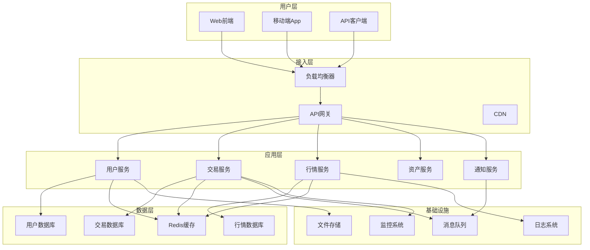
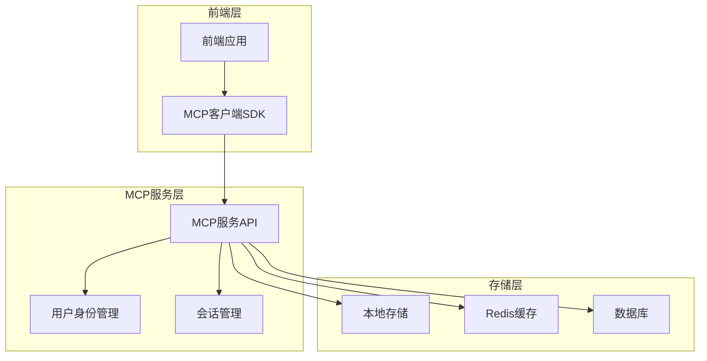

# VibeDoge交易所完整项目文档

## 目录

1. [项目概述](#1-项目概述)
2. [产品需求](#2-产品需求)
3. [技术架构](#3-技术架构)
4. [MCP服务设计](#4-mcp服务设计)
5. [API规范](#5-api规范)
6. [开发指南](#6-开发指南)
7. [部署说明](#7-部署说明)

---

## 1. 项目概述

### 1.1 技术栈

本项目是基于 React + TypeScript + Vite 构建的现代化前端应用，提供最小化的设置来实现 React 与 Vite 的热模块替换（HMR）功能。

**核心技术：**
- **前端框架**: React 18+ with TypeScript
- **构建工具**: Vite
- **包管理器**: pnpm
- **代码质量**: ESLint
- **快速刷新**: 支持 Babel 或 SWC

**可用插件：**
- [@vitejs/plugin-react](https://github.com/vitejs/vite-plugin-react/blob/main/packages/plugin-react) - 使用 Babel 进行快速刷新
- [@vitejs/plugin-react-swc](https://github.com/vitejs/vite-plugin-react/blob/main/packages/plugin-react-swc) - 使用 SWC 进行快速刷新

### 1.2 项目定位

VibeDoge交易所Demo版是一个创新的数字资产交易平台，专注于提供流畅的用户体验和强大的交易功能。项目采用现代化的技术栈，确保高性能、可扩展性和用户友好的界面。

### 1.3 开发环境配置

**ESLint 配置扩展（生产环境推荐）：**

```js
export default tseslint.config({
  extends: [
    // 移除 ...tseslint.configs.recommended 并替换为：
    ...tseslint.configs.recommendedTypeChecked,
    // 或者使用更严格的规则：
    ...tseslint.configs.strictTypeChecked,
    // 可选：添加样式规则
    ...tseslint.configs.stylisticTypeChecked,
  ],
  languageOptions: {
    // 其他选项...
    parserOptions: {
      project: ['./tsconfig.node.json', './tsconfig.app.json'],
      tsconfigRootDir: import.meta.dirname,
    },
  },
})
```

**React 专用 Lint 规则：**

```js
// eslint.config.js
import reactX from 'eslint-plugin-react-x'
import reactDom from 'eslint-plugin-react-dom'

export default tseslint.config({
  extends: [
    // 其他配置...
    // 启用 React lint 规则
    reactX.configs['recommended-typescript'],
    // 启用 React DOM lint 规则
    reactDom.configs.recommended,
  ],
  languageOptions: {
    // 其他选项...
    parserOptions: {
      project: ['./tsconfig.node.json', './tsconfig.app.json'],
      tsconfigRootDir: import.meta.dirname,
    },
  },
})
```

---

## 2. 产品需求

### 2.1 产品概述

**项目名称**: Vibe交易所Demo版  
**项目类型**: 数字资产交易平台  
**目标用户**: 数字资产交易者、投资者、区块链爱好者  
**核心价值**: 提供安全、高效、用户友好的数字资产交易体验

### 2.2 核心功能模块

#### 2.2.1 用户系统
- **用户注册/登录**: 支持邮箱、手机号注册，多重身份验证
- **KYC认证**: 身份验证流程，确保合规性
- **账户管理**: 个人信息管理、安全设置、资产概览
- **权限管理**: 不同用户角色的权限控制

#### 2.2.2 交易系统
- **现货交易**: 支持主流数字货币的现货买卖
- **订单管理**: 限价单、市价单、止损单等多种订单类型
- **交易历史**: 完整的交易记录和统计分析
- **实时行情**: 实时价格更新、K线图表、技术指标

#### 2.2.3 资产管理
- **钱包功能**: 多币种钱包，支持充值、提现
- **资产概览**: 实时资产价值、收益统计
- **交易记录**: 详细的资产变动记录
- **安全保障**: 冷热钱包分离、多重签名

#### 2.2.4 市场数据
- **行情展示**: 实时价格、涨跌幅、成交量
- **深度图**: 买卖盘深度可视化
- **K线图**: 多时间周期的价格走势
- **市场分析**: 技术指标、市场情绪分析

### 2.3 核心业务流程

#### 2.3.1 用户注册流程
1. **注册入口**: 用户访问注册页面
2. **信息填写**: 输入邮箱/手机号、设置密码
3. **验证码验证**: 邮箱/短信验证码确认
4. **账户创建**: 系统创建用户账户
5. **引导设置**: 安全设置、KYC认证引导

#### 2.3.2 交易流程
1. **登录账户**: 用户身份验证
2. **选择交易对**: 选择要交易的数字货币对
3. **下单操作**: 选择订单类型、输入价格和数量
4. **订单确认**: 确认交易信息
5. **订单执行**: 系统撮合交易
6. **交易完成**: 资产变动、交易记录更新

#### 2.3.3 充值提现流程
1. **选择操作**: 充值或提现
2. **选择币种**: 选择要操作的数字货币
3. **地址生成/输入**: 充值地址生成或提现地址输入
4. **金额确认**: 输入操作金额
5. **安全验证**: 多重身份验证
6. **操作执行**: 区块链网络确认
7. **完成通知**: 操作结果通知

### 2.4 Vibe时代稀缺资源定义

#### 2.4.1 稀缺资源概念
在Vibe生态系统中，稀缺资源是指具有限量供应、高价值属性的数字资产，包括但不限于：
- **限量NFT**: 艺术品、收藏品、游戏道具
- **治理代币**: 平台治理权益代币
- **挖矿权益**: 流动性挖矿、质押挖矿权益
- **独家访问权**: 特殊功能、服务的访问权限

#### 2.4.2 稀缺性评估标准
- **供应量限制**: 总量上限、发行机制
- **需求强度**: 市场需求、用户活跃度
- **实用价值**: 功能性、应用场景
- **社区共识**: 社区认可度、持有者分布

### 2.5 用户界面设计

#### 2.5.1 设计原则
- **简洁直观**: 界面简洁，操作直观易懂
- **响应式设计**: 适配多种设备和屏幕尺寸
- **一致性**: 保持设计风格和交互的一致性
- **可访问性**: 支持无障碍访问，提升用户体验

#### 2.5.2 主要页面设计

**首页**:
- 市场概览、热门交易对
- 快速交易入口
- 平台公告、市场资讯

**交易页面**:
- 实时K线图表
- 订单簿、交易历史
- 下单区域、持仓信息

**资产页面**:
- 资产概览、余额展示
- 充值提现入口
- 交易记录、资产变动

**个人中心**:
- 个人信息管理
- 安全设置、KYC状态
- 推荐奖励、VIP等级

#### 2.5.3 移动端适配
- **触摸优化**: 适合移动设备的触摸交互
- **性能优化**: 快速加载、流畅操作
- **离线支持**: 关键功能的离线访问能力

---

## 3. 技术架构

### 3.1 整体架构设计

#### 3.1.1 系统架构图



#### 3.1.2 架构特点
- **微服务架构**: 服务解耦，独立部署和扩展
- **高可用设计**: 多实例部署，故障自动切换
- **弹性扩展**: 根据负载自动扩缩容
- **数据一致性**: 分布式事务处理

### 3.2 技术栈描述

#### 3.2.1 前端技术栈
- **框架**: React 18 + TypeScript
- **构建工具**: Vite
- **状态管理**: Redux Toolkit / Zustand
- **UI组件**: Ant Design / Material-UI
- **图表库**: ECharts / TradingView
- **HTTP客户端**: Axios
- **WebSocket**: Socket.io-client

#### 3.2.2 后端技术栈
- **运行时**: Node.js 18+
- **框架**: Express.js / Fastify
- **数据库**: PostgreSQL + Redis
- **ORM**: Prisma / TypeORM
- **消息队列**: Redis / RabbitMQ
- **缓存**: Redis Cluster
- **搜索引擎**: Elasticsearch

#### 3.2.3 基础设施
- **容器化**: Docker + Kubernetes
- **CI/CD**: GitHub Actions / GitLab CI
- **监控**: Prometheus + Grafana
- **日志**: ELK Stack
- **安全**: JWT + OAuth2.0

### 3.3 路由定义

#### 3.3.1 前端路由

```typescript
// 主要路由配置
const routes = [
  {
    path: '/',
    component: HomePage,
    meta: { title: '首页' }
  },
  {
    path: '/trade/:symbol',
    component: TradePage,
    meta: { title: '交易', requiresAuth: true }
  },
  {
    path: '/assets',
    component: AssetsPage,
    meta: { title: '资产', requiresAuth: true }
  },
  {
    path: '/profile',
    component: ProfilePage,
    meta: { title: '个人中心', requiresAuth: true }
  },
  {
    path: '/login',
    component: LoginPage,
    meta: { title: '登录' }
  },
  {
    path: '/register',
    component: RegisterPage,
    meta: { title: '注册' }
  }
];
```

#### 3.3.2 API路由

```typescript
// API路由结构
const apiRoutes = {
  // 用户相关
  user: {
    register: 'POST /api/v1/user/register',
    login: 'POST /api/v1/user/login',
    profile: 'GET /api/v1/user/profile',
    updateProfile: 'PUT /api/v1/user/profile'
  },
  
  // 交易相关
  trade: {
    createOrder: 'POST /api/v1/trade/order',
    cancelOrder: 'DELETE /api/v1/trade/order/:id',
    getOrders: 'GET /api/v1/trade/orders',
    getOrderHistory: 'GET /api/v1/trade/history'
  },
  
  // 行情相关
  market: {
    getTickers: 'GET /api/v1/market/tickers',
    getKlines: 'GET /api/v1/market/klines/:symbol',
    getDepth: 'GET /api/v1/market/depth/:symbol'
  },
  
  // 资产相关
  asset: {
    getBalances: 'GET /api/v1/asset/balances',
    deposit: 'POST /api/v1/asset/deposit',
    withdraw: 'POST /api/v1/asset/withdraw',
    getTransactions: 'GET /api/v1/asset/transactions'
  }
};
```

### 3.4 API定义

#### 3.4.1 用户管理API

**用户注册**
```http
POST /api/v1/user/register
Content-Type: application/json

{
  "email": "user@example.com",
  "password": "password123",
  "confirmPassword": "password123",
  "inviteCode": "optional"
}

Response:
{
  "success": true,
  "data": {
    "userId": "uuid",
    "email": "user@example.com",
    "token": "jwt_token"
  },
  "message": "注册成功"
}
```

**用户登录**
```http
POST /api/v1/user/login
Content-Type: application/json

{
  "email": "user@example.com",
  "password": "password123"
}

Response:
{
  "success": true,
  "data": {
    "userId": "uuid",
    "email": "user@example.com",
    "token": "jwt_token",
    "refreshToken": "refresh_token"
  },
  "message": "登录成功"
}
```

#### 3.4.2 交易API

**创建订单**
```http
POST /api/v1/trade/order
Authorization: Bearer {token}
Content-Type: application/json

{
  "symbol": "BTC/USDT",
  "side": "buy",
  "type": "limit",
  "amount": "0.001",
  "price": "50000"
}

Response:
{
  "success": true,
  "data": {
    "orderId": "uuid",
    "symbol": "BTC/USDT",
    "side": "buy",
    "type": "limit",
    "amount": "0.001",
    "price": "50000",
    "status": "pending",
    "createdAt": "2024-01-01T00:00:00Z"
  },
  "message": "订单创建成功"
}
```

#### 3.4.3 行情API

**获取K线数据**
```http
GET /api/v1/market/klines/BTC-USDT?interval=1h&limit=100

Response:
{
  "success": true,
  "data": [
    {
      "timestamp": 1640995200000,
      "open": "50000",
      "high": "51000",
      "low": "49500",
      "close": "50500",
      "volume": "100.5"
    }
  ],
  "message": "获取成功"
}
```

### 3.5 服务器架构

#### 3.5.1 部署架构

```yaml
# Kubernetes部署配置示例
apiVersion: apps/v1
kind: Deployment
metadata:
  name: vibe-frontend
spec:
  replicas: 3
  selector:
    matchLabels:
      app: vibe-frontend
  template:
    metadata:
      labels:
        app: vibe-frontend
    spec:
      containers:
      - name: frontend
        image: vibe/frontend:latest
        ports:
        - containerPort: 80
        env:
        - name: API_BASE_URL
          value: "https://api.vibedoge.com"
---
apiVersion: v1
kind: Service
metadata:
  name: vibe-frontend-service
spec:
  selector:
    app: vibe-frontend
  ports:
  - port: 80
    targetPort: 80
  type: LoadBalancer
```

#### 3.5.2 性能优化

**前端优化**:
- 代码分割和懒加载
- 静态资源CDN加速
- 图片压缩和WebP格式
- Service Worker缓存策略

**后端优化**:
- 数据库索引优化
- Redis缓存策略
- 连接池管理
- 异步处理和队列

### 3.6 数据模型

#### 3.6.1 用户数据模型

```typescript
interface User {
  id: string;
  email: string;
  username?: string;
  passwordHash: string;
  profile: {
    firstName?: string;
    lastName?: string;
    avatar?: string;
    phone?: string;
    country?: string;
  };
  security: {
    twoFactorEnabled: boolean;
    emailVerified: boolean;
    phoneVerified: boolean;
    kycStatus: 'pending' | 'approved' | 'rejected';
  };
  preferences: {
    language: string;
    timezone: string;
    notifications: {
      email: boolean;
      sms: boolean;
      push: boolean;
    };
  };
  metadata: {
    createdAt: Date;
    updatedAt: Date;
    lastLoginAt?: Date;
    ipAddress?: string;
    userAgent?: string;
  };
}
```

#### 3.6.2 交易数据模型

```typescript
interface Order {
  id: string;
  userId: string;
  symbol: string;
  side: 'buy' | 'sell';
  type: 'market' | 'limit' | 'stop' | 'stop_limit';
  amount: string;
  price?: string;
  stopPrice?: string;
  status: 'pending' | 'partial' | 'filled' | 'cancelled' | 'rejected';
  filledAmount: string;
  remainingAmount: string;
  averagePrice?: string;
  fees: {
    currency: string;
    amount: string;
  }[];
  metadata: {
    createdAt: Date;
    updatedAt: Date;
    filledAt?: Date;
    cancelledAt?: Date;
  };
}

interface Trade {
  id: string;
  orderId: string;
  symbol: string;
  side: 'buy' | 'sell';
  amount: string;
  price: string;
  fee: string;
  feeCurrency: string;
  timestamp: Date;
}
```

#### 3.6.3 资产数据模型

```typescript
interface Balance {
  userId: string;
  currency: string;
  available: string;
  frozen: string;
  total: string;
  updatedAt: Date;
}

interface Transaction {
  id: string;
  userId: string;
  type: 'deposit' | 'withdraw' | 'trade' | 'fee' | 'bonus';
  currency: string;
  amount: string;
  balance: string;
  status: 'pending' | 'confirmed' | 'failed';
  reference?: string;
  metadata: {
    createdAt: Date;
    confirmedAt?: Date;
    blockHash?: string;
    txHash?: string;
  };
}
```

### 3.7 前端UI架构

#### 3.7.1 组件架构

```
src/
├── components/           # 通用组件
│   ├── common/          # 基础组件
│   │   ├── Button/
│   │   ├── Input/
│   │   ├── Modal/
│   │   └── Loading/
│   ├── business/        # 业务组件
│   │   ├── OrderBook/
│   │   ├── TradingChart/
│   │   ├── AssetCard/
│   │   └── UserProfile/
│   └── layout/          # 布局组件
│       ├── Header/
│       ├── Sidebar/
│       └── Footer/
├── pages/               # 页面组件
│   ├── Home/
│   ├── Trade/
│   ├── Assets/
│   └── Profile/
├── hooks/               # 自定义Hook
│   ├── useAuth.ts
│   ├── useWebSocket.ts
│   └── useLocalStorage.ts
├── services/            # API服务
│   ├── api.ts
│   ├── websocket.ts
│   └── auth.ts
├── store/               # 状态管理
│   ├── slices/
│   └── index.ts
├── utils/               # 工具函数
│   ├── format.ts
│   ├── validation.ts
│   └── constants.ts
└── types/               # 类型定义
    ├── api.ts
    ├── user.ts
    └── trade.ts
```

#### 3.7.2 状态管理

```typescript
// Redux Toolkit状态管理示例
import { createSlice, PayloadAction } from '@reduxjs/toolkit';

interface UserState {
  currentUser: User | null;
  isAuthenticated: boolean;
  loading: boolean;
  error: string | null;
}

const initialState: UserState = {
  currentUser: null,
  isAuthenticated: false,
  loading: false,
  error: null,
};

const userSlice = createSlice({
  name: 'user',
  initialState,
  reducers: {
    loginStart: (state) => {
      state.loading = true;
      state.error = null;
    },
    loginSuccess: (state, action: PayloadAction<User>) => {
      state.currentUser = action.payload;
      state.isAuthenticated = true;
      state.loading = false;
    },
    loginFailure: (state, action: PayloadAction<string>) => {
      state.error = action.payload;
      state.loading = false;
    },
    logout: (state) => {
      state.currentUser = null;
      state.isAuthenticated = false;
    },
  },
});

export const { loginStart, loginSuccess, loginFailure, logout } = userSlice.actions;
export default userSlice.reducer;
```

---

## 4. MCP服务设计

### 4.1 MCP服务架构概述

MCP (Model Context Protocol) 服务是VibeDoge交易所Demo版的核心用户身份管理服务，负责用户ID生成、会话管理和身份验证。该服务采用轻量级设计，支持前端无缝集成，为用户提供免注册的流畅体验。

**服务定位**: 用户身份管理和会话维护的核心服务  
**设计理念**: 轻量级、无状态、高可用、易集成  
**技术特色**: 免注册体验、本地存储、会话持久化、跨平台兼容

### 4.2 整体架构设计



### 4.3 服务分层架构

| 层级 | 组件 | 职责 |
|------|------|------|
| 接入层 | MCP客户端SDK | 前端集成、API调用、本地存储管理 |
| 服务层 | MCP服务API | 用户管理、会话控制、身份验证 |
| 数据层 | 存储服务 | 用户数据持久化、会话缓存 |

### 4.4 核心组件设计

#### 4.4.1 MCP客户端SDK

```typescript
class MCPService {
  // 用户ID生成
  generateUserId(): string
  
  // 用户创建
  createUser(): Promise<MCPUser>
  
  // 会话管理
  restoreFromStorage(): MCPUser | null
  heartbeat(): void
  clearSession(): void
  
  // 存储管理
  private saveToStorage(user: MCPUser): void
}
```

#### 4.4.2 用户数据模型

```typescript
interface MCPUser {
  id: string;           // 用户唯一标识
  createdAt: string;    // 创建时间
  lastActiveAt: string; // 最后活跃时间
  sessionToken: string; // 会话令牌
}
```

### 4.5 技术栈

#### 4.5.1 前端技术
- **TypeScript**: 类型安全的JavaScript
- **React**: 用户界面框架
- **LocalStorage**: 本地数据存储
- **Fetch API**: HTTP请求处理

#### 4.5.2 后端技术
- **Node.js**: 运行时环境
- **Express**: Web框架
- **UUID**: 唯一标识符生成
- **Redis**: 会话缓存（可选）
- **PostgreSQL**: 数据持久化（可选）

#### 4.5.3 开发工具
- **ESLint**: 代码质量检查
- **Jest**: 单元测试
- **Docker**: 容器化部署
- **PM2**: 进程管理

### 4.6 核心功能实现

#### 4.6.1 用户身份管理

**用户ID生成策略**:
```typescript
// 生成规则：mcp_时间戳_随机字符串
generateUserId(): string {
  const timestamp = Date.now();
  const random = Math.random().toString(36).substring(2, 15);
  return `mcp_${timestamp}_${random}`;
}
```

**用户创建流程**:
1. 前端调用`createUser()`方法
2. 生成唯一用户ID和会话令牌
3. 创建用户对象并保存到本地存储
4. 返回用户信息给前端

#### 4.6.2 会话管理

**会话生命周期**:
- **创建**: 用户首次访问时自动创建
- **维护**: 通过心跳机制保持活跃状态
- **恢复**: 页面刷新后从本地存储恢复
- **清除**: 用户主动退出或会话过期

**心跳机制**:
```typescript
// 定期更新用户活跃时间
heartbeat(): void {
  if (this.currentUser) {
    this.currentUser.lastActiveAt = new Date().toISOString();
    this.saveToStorage(this.currentUser);
  }
}
```

#### 4.6.3 本地存储管理

**存储策略**:
- **存储键**: `mcp_user_session`
- **数据格式**: JSON字符串
- **容错处理**: 存储失败时降级处理
- **隐私保护**: 仅存储必要信息

**数据同步**:
```typescript
// 保存到本地存储
private saveToStorage(user: MCPUser): void {
  try {
    localStorage.setItem(this.storageKey, JSON.stringify(user));
  } catch (error) {
    console.warn('Failed to save MCP user to localStorage:', error);
  }
}
```

### 4.7 安全设计

#### 4.7.1 数据安全
- **最小化原则**: 仅收集必要的用户信息
- **本地存储**: 敏感数据不传输到服务器
- **会话令牌**: 使用随机生成的会话标识
- **HTTPS传输**: 所有API调用使用加密传输

#### 4.7.2 隐私保护
- **匿名化**: 用户ID不包含个人信息
- **临时性**: 会话数据可随时清除
- **透明性**: 用户可查看和控制存储的数据
- **合规性**: 符合GDPR等隐私法规要求

#### 4.7.3 防护措施
- **频率限制**: API调用频率限制
- **输入验证**: 严格的参数校验
- **错误处理**: 安全的错误信息返回
- **日志审计**: 关键操作日志记录

### 4.8 性能优化

#### 4.8.1 前端优化
- **懒加载**: 按需加载MCP服务
- **缓存策略**: 本地存储减少API调用
- **批量操作**: 合并多个API请求
- **错误重试**: 网络异常自动重试

#### 4.8.2 后端优化
- **连接池**: 数据库连接复用
- **缓存层**: Redis缓存热点数据
- **负载均衡**: 多实例部署
- **监控告警**: 实时性能监控

#### 4.8.3 存储优化
- **索引优化**: 数据库查询优化
- **数据压缩**: 减少存储空间
- **定期清理**: 过期数据自动清理
- **备份策略**: 数据安全备份

---

## 5. API规范

### 5.1 MCP服务API接口

#### 5.1.1 本地开发环境配置
- **本地API地址**: `http://localhost:3001/api/mcp`
- **前端开发地址**: `http://localhost:5173`
- **CORS配置**: 允许本地前端访问
- **调试端口**: 3001

#### 5.1.2 用户管理接口

**生成用户ID**
```http
POST http://localhost:3001/api/mcp/users/generate-id

Response:
{
  "success": true,
  "data": {
    "userId": "mcp_1704067200000_abc123def456",
    "createdAt": "2024-01-01T00:00:00.000Z",
    "sessionToken": "xyz789uvw012"
  },
  "message": "用户ID生成成功"
}
```

**验证会话**
```http
POST http://localhost:3001/api/mcp/sessions/validate

Request:
{
  "userId": "mcp_1704067200000_abc123def456",
  "sessionToken": "xyz789uvw012"
}

Response:
{
  "success": true,
  "data": {
    "valid": true,
    "expiresAt": "2024-01-02T00:00:00.000Z"
  },
  "message": "会话验证成功"
}
```

#### 5.1.3 会话管理接口

**心跳更新**
```http
POST /api/mcp/sessions/heartbeat

Request:
{
  "userId": "mcp_1704067200000_abc123def456",
  "sessionToken": "xyz789uvw012"
}
```

**清除会话**
```http
DELETE /api/mcp/sessions/{userId}
```

#### 5.1.4 健康检查接口

**服务状态**
```http
GET /api/mcp/health

Response:
{
  "success": true,
  "data": {
    "status": "healthy",
    "version": "1.0.0",
    "uptime": 86400,
    "activeUsers": 1234
  },
  "timestamp": "2024-01-01T00:00:00.000Z"
}
```

### 5.2 通用API规范

#### 5.2.1 接口概述

MCP服务API提供了完整的用户身份管理和会话控制功能，支持前端应用的无缝集成。所有接口遵循RESTful设计原则，使用JSON格式进行数据交换。

**基础信息**:
- **协议**: HTTP/HTTPS
- **数据格式**: JSON
- **字符编码**: UTF-8
- **API版本**: v1

#### 5.2.2 用户管理接口

**用户注册**
```http
POST /api/v1/users/register
Content-Type: application/json

{
  "email": "user@example.com",
  "password": "securePassword123",
  "username": "testuser",
  "inviteCode": "INVITE123"
}

Response:
{
  "success": true,
  "data": {
    "userId": "uuid-string",
    "email": "user@example.com",
    "username": "testuser",
    "accessToken": "jwt-token",
    "refreshToken": "refresh-token"
  },
  "message": "用户注册成功"
}
```

**用户登录**
```http
POST /api/v1/users/login
Content-Type: application/json

{
  "email": "user@example.com",
  "password": "securePassword123"
}

Response:
{
  "success": true,
  "data": {
    "userId": "uuid-string",
    "email": "user@example.com",
    "accessToken": "jwt-token",
    "refreshToken": "refresh-token",
    "expiresIn": 3600
  },
  "message": "登录成功"
}
```

**获取用户信息**
```http
GET /api/v1/users/profile
Authorization: Bearer {accessToken}

Response:
{
  "success": true,
  "data": {
    "userId": "uuid-string",
    "email": "user@example.com",
    "username": "testuser",
    "profile": {
      "firstName": "John",
      "lastName": "Doe",
      "avatar": "https://example.com/avatar.jpg",
      "phone": "+1234567890"
    },
    "preferences": {
      "language": "zh-CN",
      "timezone": "Asia/Shanghai",
      "notifications": {
        "email": true,
        "sms": false
      }
    },
    "security": {
      "twoFactorEnabled": false,
      "emailVerified": true,
      "phoneVerified": false
    }
  },
  "message": "获取用户信息成功"
}
```

#### 5.2.3 会话管理接口

**创建会话**
```http
POST /api/v1/sessions
Content-Type: application/json

{
  "userId": "uuid-string",
  "deviceInfo": {
    "platform": "web",
    "userAgent": "Mozilla/5.0...",
    "ipAddress": "192.168.1.1"
  }
}

Response:
{
  "success": true,
  "data": {
    "sessionId": "session-uuid",
    "userId": "uuid-string",
    "expiresAt": "2024-01-02T00:00:00.000Z",
    "createdAt": "2024-01-01T00:00:00.000Z"
  },
  "message": "会话创建成功"
}
```

**刷新会话**
```http
POST /api/v1/sessions/refresh
Content-Type: application/json

{
  "refreshToken": "refresh-token-string"
}

Response:
{
  "success": true,
  "data": {
    "accessToken": "new-jwt-token",
    "refreshToken": "new-refresh-token",
    "expiresIn": 3600
  },
  "message": "令牌刷新成功"
}
```

**销毁会话**
```http
DELETE /api/v1/sessions/{sessionId}
Authorization: Bearer {accessToken}

Response:
{
  "success": true,
  "message": "会话已销毁"
}
```

#### 5.2.4 数据同步接口

**同步用户数据**
```http
POST /api/v1/sync/user-data
Authorization: Bearer {accessToken}
Content-Type: application/json

{
  "lastSyncTime": "2024-01-01T00:00:00.000Z",
  "dataTypes": ["profile", "preferences", "settings"]
}

Response:
{
  "success": true,
  "data": {
    "profile": {
      "updatedAt": "2024-01-01T12:00:00.000Z",
      "data": { /* 用户资料数据 */ }
    },
    "preferences": {
      "updatedAt": "2024-01-01T10:00:00.000Z",
      "data": { /* 用户偏好数据 */ }
    }
  },
  "message": "数据同步成功"
}
```

**上传本地数据**
```http
POST /api/v1/sync/upload
Authorization: Bearer {accessToken}
Content-Type: application/json

{
  "dataType": "preferences",
  "data": {
    "language": "en-US",
    "theme": "dark",
    "notifications": {
      "email": true,
      "push": false
    }
  },
  "timestamp": "2024-01-01T12:00:00.000Z"
}

Response:
{
  "success": true,
  "data": {
    "syncId": "sync-uuid",
    "status": "completed",
    "conflictResolution": "server_wins"
  },
  "message": "数据上传成功"
}
```

#### 5.2.5 系统接口

**系统状态检查**
```http
GET /api/v1/system/status

Response:
{
  "success": true,
  "data": {
    "status": "operational",
    "version": "1.0.0",
    "uptime": 86400,
    "services": {
      "database": "healthy",
      "redis": "healthy",
      "messageQueue": "healthy"
    },
    "metrics": {
      "activeUsers": 1234,
      "requestsPerSecond": 150,
      "averageResponseTime": 120
    }
  },
  "timestamp": "2024-01-01T00:00:00.000Z"
}
```

**系统配置获取**
```http
GET /api/v1/system/config
Authorization: Bearer {accessToken}

Response:
{
  "success": true,
  "data": {
    "features": {
      "twoFactorAuth": true,
      "socialLogin": true,
      "emailVerification": true
    },
    "limits": {
      "sessionTimeout": 3600,
      "maxSessions": 5,
      "rateLimitPerMinute": 60
    },
    "endpoints": {
      "websocket": "wss://api.example.com/ws",
      "upload": "https://api.example.com/upload"
    }
  },
  "message": "配置获取成功"
}
```

### 5.3 错误代码

#### 5.3.1 HTTP状态码

| 状态码 | 说明 | 使用场景 |
|--------|------|----------|
| 200 | OK | 请求成功 |
| 201 | Created | 资源创建成功 |
| 400 | Bad Request | 请求参数错误 |
| 401 | Unauthorized | 未授权访问 |
| 403 | Forbidden | 权限不足 |
| 404 | Not Found | 资源不存在 |
| 409 | Conflict | 资源冲突 |
| 429 | Too Many Requests | 请求频率超限 |
| 500 | Internal Server Error | 服务器内部错误 |
| 503 | Service Unavailable | 服务不可用 |

#### 5.3.2 业务错误码

| 错误码 | 错误信息 | 说明 |
|--------|----------|------|
| 10001 | 用户不存在 | 指定的用户ID不存在 |
| 10002 | 密码错误 | 用户密码验证失败 |
| 10003 | 邮箱已存在 | 注册邮箱已被使用 |
| 10004 | 用户名已存在 | 注册用户名已被使用 |
| 10005 | 邮箱格式错误 | 邮箱地址格式不正确 |
| 20001 | 会话不存在 | 指定的会话ID不存在 |
| 20002 | 会话已过期 | 用户会话已超时 |
| 20003 | 令牌无效 | JWT令牌验证失败 |
| 20004 | 刷新令牌无效 | 刷新令牌已过期或无效 |
| 30001 | 参数缺失 | 必需参数未提供 |
| 30002 | 参数格式错误 | 参数格式不符合要求 |
| 30003 | 参数值超出范围 | 参数值超出允许范围 |
| 40001 | 权限不足 | 用户权限不足以执行操作 |
| 40002 | 账户被锁定 | 用户账户已被管理员锁定 |
| 40003 | 需要邮箱验证 | 操作需要先验证邮箱 |
| 50001 | 数据库连接失败 | 数据库服务不可用 |
| 50002 | 缓存服务异常 | Redis缓存服务异常 |
| 50003 | 外部服务调用失败 | 第三方服务调用失败 |

#### 5.3.3 错误响应格式

```json
{
  "success": false,
  "error": {
    "code": 10001,
    "message": "用户不存在",
    "details": "指定的用户ID在系统中不存在",
    "field": "userId"
  },
  "timestamp": "2024-01-01T00:00:00.000Z",
  "requestId": "req-uuid-string"
}
```

### 5.4 认证机制

#### 5.4.1 JWT令牌认证

**令牌结构**:
```
Header.Payload.Signature
```

**Header**:
```json
{
  "alg": "HS256",
  "typ": "JWT"
}
```

**Payload**:
```json
{
  "sub": "user-uuid",
  "iat": 1640995200,
  "exp": 1640998800,
  "aud": "vibedoge-api",
  "iss": "vibedoge-auth",
  "scope": ["read", "write"]
}
```

#### 5.4.2 API密钥认证

**请求头格式**:
```http
X-API-Key: your-api-key
X-API-Secret: your-api-secret
X-API-Timestamp: 1640995200
X-API-Signature: calculated-signature
```

**签名计算**:
```
signature = HMAC-SHA256(timestamp + method + path + body, secret)
```

### 5.5 限流策略

#### 5.5.1 限流规则

| 接口类型 | 限制频率 | 时间窗口 | 超限处理 |
|----------|----------|----------|----------|
| 登录接口 | 5次/分钟 | 1分钟 | 临时锁定 |
| 注册接口 | 3次/分钟 | 1分钟 | 延迟响应 |
| 查询接口 | 100次/分钟 | 1分钟 | 降级服务 |
| 写入接口 | 50次/分钟 | 1分钟 | 队列处理 |
| 上传接口 | 10次/分钟 | 1分钟 | 拒绝请求 |

#### 5.5.2 限流响应

```json
{
  "success": false,
  "error": {
    "code": 42901,
    "message": "请求频率超限",
    "details": "您的请求频率过高，请稍后再试",
    "retryAfter": 60
  },
  "timestamp": "2024-01-01T00:00:00.000Z"
}
```

### 5.6 SDK集成示例

#### 5.6.1 JavaScript SDK

```javascript
// MCP SDK初始化
import { MCPClient } from '@vibedoge/mcp-sdk';

const client = new MCPClient({
  baseURL: 'https://api.vibedoge.com',
  apiKey: 'your-api-key',
  timeout: 5000
});

// 用户注册
try {
  const result = await client.users.register({
    email: 'user@example.com',
    password: 'securePassword123',
    username: 'testuser'
  });
  console.log('注册成功:', result.data);
} catch (error) {
  console.error('注册失败:', error.message);
}

// 用户登录
try {
  const result = await client.users.login({
    email: 'user@example.com',
    password: 'securePassword123'
  });
  
  // 保存令牌
  client.setAccessToken(result.data.accessToken);
  localStorage.setItem('refreshToken', result.data.refreshToken);
  
  console.log('登录成功:', result.data);
} catch (error) {
  console.error('登录失败:', error.message);
}

// 获取用户信息
try {
  const result = await client.users.getProfile();
  console.log('用户信息:', result.data);
} catch (error) {
  if (error.code === 20003) {
    // 令牌无效，尝试刷新
    await client.auth.refreshToken();
    // 重试获取用户信息
    const result = await client.users.getProfile();
    console.log('用户信息:', result.data);
  }
}
```

#### 5.6.2 React Hook集成

```typescript
// useMCP Hook
import { useState, useEffect, useCallback } from 'react';
import { MCPClient } from '@vibedoge/mcp-sdk';

interface MCPUser {
  id: string;
  email: string;
  username: string;
  profile: any;
}

interface UseMCPReturn {
  user: MCPUser | null;
  isAuthenticated: boolean;
  loading: boolean;
  login: (email: string, password: string) => Promise<void>;
  logout: () => void;
  register: (userData: any) => Promise<void>;
}

export const useMCP = (): UseMCPReturn => {
  const [user, setUser] = useState<MCPUser | null>(null);
  const [loading, setLoading] = useState(true);
  const [client] = useState(() => new MCPClient({
    baseURL: process.env.REACT_APP_API_URL,
    apiKey: process.env.REACT_APP_API_KEY
  }));

  const isAuthenticated = !!user;

  // 初始化时检查本地存储的令牌
  useEffect(() => {
    const initAuth = async () => {
      const token = localStorage.getItem('accessToken');
      if (token) {
        client.setAccessToken(token);
        try {
          const result = await client.users.getProfile();
          setUser(result.data);
        } catch (error) {
          // 令牌无效，清除本地存储
          localStorage.removeItem('accessToken');
          localStorage.removeItem('refreshToken');
        }
      }
      setLoading(false);
    };

    initAuth();
  }, [client]);

  const login = useCallback(async (email: string, password: string) => {
    setLoading(true);
    try {
      const result = await client.users.login({ email, password });
      
      // 保存令牌
      localStorage.setItem('accessToken', result.data.accessToken);
      localStorage.setItem('refreshToken', result.data.refreshToken);
      client.setAccessToken(result.data.accessToken);
      
      // 获取用户信息
      const profileResult = await client.users.getProfile();
      setUser(profileResult.data);
    } finally {
      setLoading(false);
    }
  }, [client]);

  const logout = useCallback(() => {
    localStorage.removeItem('accessToken');
    localStorage.removeItem('refreshToken');
    client.setAccessToken(null);
    setUser(null);
  }, [client]);

  const register = useCallback(async (userData: any) => {
    setLoading(true);
    try {
      const result = await client.users.register(userData);
      
      // 注册成功后自动登录
      localStorage.setItem('accessToken', result.data.accessToken);
      localStorage.setItem('refreshToken', result.data.refreshToken);
      client.setAccessToken(result.data.accessToken);
      
      const profileResult = await client.users.getProfile();
      setUser(profileResult.data);
    } finally {
      setLoading(false);
    }
  }, [client]);

  return {
    user,
    isAuthenticated,
    loading,
    login,
    logout,
    register
  };
};
```

---

## 6. 开发指南

### 6.1 开发环境搭建

#### 6.1.1 环境要求

**基础环境**:
- Node.js 18.0.0 或更高版本
- pnpm 8.0.0 或更高版本
- Git 2.30.0 或更高版本

**开发工具**:
- VS Code (推荐)
- Chrome DevTools
- Postman 或类似的 API 测试工具

**数据库**:
- PostgreSQL 14+ (主数据库)
- Redis 6+ (缓存和会话存储)

#### 6.1.2 项目初始化

**克隆项目**:
```bash
git clone https://github.com/your-org/vibe-doge-exchange.git
cd vibe-doge-exchange
```

**安装依赖**:
```bash
pnpm install
```

**环境配置**:
```bash
# 复制环境变量模板
cp .env.example .env

# 编辑环境变量
vim .env
```

**启动开发服务器**:
```bash
# 启动前端开发服务器
pnpm dev

# 启动后端服务器
pnpm start:api
```

#### 6.1.3 项目结构

```
mcp-service/
├── src/
│   ├── controllers/          # 控制器层
│   │   ├── user.controller.ts
│   │   ├── session.controller.ts
│   │   └── data.controller.ts
│   ├── services/             # 服务层
│   │   ├── user.service.ts
│   │   ├── session.service.ts
│   │   └── data.service.ts
│   ├── models/               # 数据模型
│   │   ├── user.model.ts
│   │   ├── session.model.ts
│   │   └── data.model.ts
│   ├── middleware/           # 中间件
│   │   ├── auth.middleware.ts
│   │   ├── validation.middleware.ts
│   │   └── rate-limit.middleware.ts
│   ├── routes/               # 路由定义
│   │   ├── user.routes.ts
│   │   ├── session.routes.ts
│   │   └── data.routes.ts
│   ├── utils/                # 工具函数
│   │   ├── crypto.util.ts
│   │   ├── validation.util.ts
│   │   └── logger.util.ts
│   ├── config/               # 配置文件
│   │   ├── database.config.ts
│   │   ├── redis.config.ts
│   │   └── app.config.ts
│   └── app.ts                # 应用入口
├── tests/                    # 测试文件
│   ├── unit/
│   ├── integration/
│   └── e2e/
├── docs/                     # 文档
├── scripts/                  # 脚本文件
├── package.json
├── tsconfig.json
├── .env.example
└── README.md
```

### 6.2 核心模块开发

#### 6.2.1 用户管理模块

**用户模型定义**:
```typescript
// src/models/user.model.ts
export interface MCPUser {
  id: string;
  username: string;
  email: string;
  passwordHash: string;
  profile: {
    firstName?: string;
    lastName?: string;
    avatar?: string;
    bio?: string;
  };
  preferences: {
    language: string;
    timezone: string;
    theme: 'light' | 'dark';
    notifications: {
      email: boolean;
      push: boolean;
      sms: boolean;
    };
  };
  security: {
    twoFactorEnabled: boolean;
    lastPasswordChange: Date;
    failedLoginAttempts: number;
    lockedUntil?: Date;
  };
  metadata: {
    createdAt: Date;
    updatedAt: Date;
    lastLoginAt?: Date;
    ipAddress?: string;
    userAgent?: string;
  };
  status: 'active' | 'inactive' | 'suspended' | 'deleted';
}

export interface CreateUserRequest {
  username: string;
  email: string;
  password: string;
  firstName?: string;
  lastName?: string;
}

export interface UpdateUserRequest {
  firstName?: string;
  lastName?: string;
  bio?: string;
  preferences?: Partial<MCPUser['preferences']>;
}

export interface UserLoginRequest {
  email: string;
  password: string;
  rememberMe?: boolean;
}

export interface UserLoginResponse {
  user: Omit<MCPUser, 'passwordHash'>;
  token: string;
  refreshToken: string;
  expiresIn: number;
}
```

**用户服务实现**:
```typescript
// src/services/user.service.ts
import bcrypt from 'bcrypt';
import jwt from 'jsonwebtoken';
import { v4 as uuidv4 } from 'uuid';
import { MCPUser, CreateUserRequest, UpdateUserRequest, UserLoginRequest, UserLoginResponse } from '../models/user.model';
import { DatabaseService } from './database.service';
import { RedisService } from './redis.service';
import { ValidationError, AuthenticationError, NotFoundError } from '../utils/errors';

export class UserService {
  private db: DatabaseService;
  private redis: RedisService;
  private readonly saltRounds = 12;
  private readonly jwtSecret = process.env.JWT_SECRET!;
  private readonly jwtExpiresIn = process.env.JWT_EXPIRES_IN || '24h';

  constructor() {
    this.db = new DatabaseService();
    this.redis = new RedisService();
  }

  async createUser(userData: CreateUserRequest): Promise<MCPUser> {
    // 验证用户输入
    await this.validateUserData(userData);
    
    // 检查用户是否已存在
    const existingUser = await this.findUserByEmail(userData.email);
    if (existingUser) {
      throw new ValidationError('用户已存在');
    }

    // 密码加密
    const passwordHash = await bcrypt.hash(userData.password, this.saltRounds);

    // 创建用户对象
    const user: MCPUser = {
      id: uuidv4(),
      username: userData.username,
      email: userData.email,
      passwordHash,
      profile: {
        firstName: userData.firstName,
        lastName: userData.lastName,
      },
      preferences: {
        language: 'zh-CN',
        timezone: 'Asia/Shanghai',
        theme: 'light',
        notifications: {
          email: true,
          push: true,
          sms: false,
        },
      },
      security: {
        twoFactorEnabled: false,
        lastPasswordChange: new Date(),
        failedLoginAttempts: 0,
      },
      metadata: {
        createdAt: new Date(),
        updatedAt: new Date(),
      },
      status: 'active',
    };

    // 保存到数据库
    await this.db.users.create(user);
    
    return user;
  }

  async authenticateUser(loginData: UserLoginRequest): Promise<UserLoginResponse> {
    const user = await this.findUserByEmail(loginData.email);
    if (!user) {
      throw new AuthenticationError('用户名或密码错误');
    }

    // 检查账户状态
    if (user.status !== 'active') {
      throw new AuthenticationError('账户已被禁用');
    }

    // 检查是否被锁定
    if (user.security.lockedUntil && user.security.lockedUntil > new Date()) {
      throw new AuthenticationError('账户已被锁定，请稍后再试');
    }

    // 验证密码
    const isPasswordValid = await bcrypt.compare(loginData.password, user.passwordHash);
    if (!isPasswordValid) {
      await this.handleFailedLogin(user.id);
      throw new AuthenticationError('用户名或密码错误');
    }

    // 重置失败登录计数
    await this.resetFailedLoginAttempts(user.id);

    // 生成JWT令牌
    const token = this.generateToken(user);
    const refreshToken = this.generateRefreshToken(user);

    // 更新最后登录时间
    await this.updateLastLogin(user.id);

    // 缓存用户会话
    await this.cacheUserSession(user.id, token);

    return {
      user: this.sanitizeUser(user),
      token,
      refreshToken,
      expiresIn: 24 * 60 * 60, // 24小时
    };
  }

  async updateUser(userId: string, updateData: UpdateUserRequest): Promise<MCPUser> {
    const user = await this.findUserById(userId);
    if (!user) {
      throw new NotFoundError('用户不存在');
    }

    const updatedUser = {
      ...user,
      profile: {
        ...user.profile,
        ...updateData,
      },
      preferences: {
        ...user.preferences,
        ...updateData.preferences,
      },
      metadata: {
        ...user.metadata,
        updatedAt: new Date(),
      },
    };

    await this.db.users.update(userId, updatedUser);
    return updatedUser;
  }

  private async validateUserData(userData: CreateUserRequest): Promise<void> {
    if (!userData.email || !this.isValidEmail(userData.email)) {
      throw new ValidationError('无效的邮箱地址');
    }

    if (!userData.password || userData.password.length < 8) {
      throw new ValidationError('密码长度至少为8位');
    }

    if (!userData.username || userData.username.length < 3) {
      throw new ValidationError('用户名长度至少为3位');
    }
  }

  private isValidEmail(email: string): boolean {
    const emailRegex = /^[^\s@]+@[^\s@]+\.[^\s@]+$/;
    return emailRegex.test(email);
  }

  private generateToken(user: MCPUser): string {
    return jwt.sign(
      {
        userId: user.id,
        email: user.email,
        username: user.username,
      },
      this.jwtSecret,
      { expiresIn: this.jwtExpiresIn }
    );
  }

  private generateRefreshToken(user: MCPUser): string {
    return jwt.sign(
      { userId: user.id },
      this.jwtSecret + '_refresh',
      { expiresIn: '7d' }
    );
  }

  private sanitizeUser(user: MCPUser): Omit<MCPUser, 'passwordHash'> {
    const { passwordHash, ...sanitizedUser } = user;
    return sanitizedUser;
  }

  private async findUserByEmail(email: string): Promise<MCPUser | null> {
    return await this.db.users.findByEmail(email);
  }

  private async findUserById(id: string): Promise<MCPUser | null> {
    return await this.db.users.findById(id);
  }

  private async handleFailedLogin(userId: string): Promise<void> {
    const user = await this.findUserById(userId);
    if (!user) return;

    const failedAttempts = user.security.failedLoginAttempts + 1;
    const updateData: Partial<MCPUser> = {
      security: {
        ...user.security,
        failedLoginAttempts: failedAttempts,
      },
    };

    // 如果失败次数超过5次，锁定账户30分钟
    if (failedAttempts >= 5) {
      updateData.security!.lockedUntil = new Date(Date.now() + 30 * 60 * 1000);
    }

    await this.db.users.update(userId, updateData);
  }

  private async resetFailedLoginAttempts(userId: string): Promise<void> {
    await this.db.users.update(userId, {
      security: {
        failedLoginAttempts: 0,
        lockedUntil: undefined,
      },
    });
  }

  private async updateLastLogin(userId: string): Promise<void> {
    await this.db.users.update(userId, {
      metadata: {
        lastLoginAt: new Date(),
      },
    });
  }

  private async cacheUserSession(userId: string, token: string): Promise<void> {
    await this.redis.set(`session:${userId}`, token, 24 * 60 * 60); // 24小时过期
  }
}
```

#### 6.2.2 会话管理模块

**会话服务实现**:
```typescript
// src/services/session.service.ts
import { MCPUser } from '../models/user.model';
import { Session, SessionValidationResult } from '../models/session.model';
import { RedisService } from './redis.service';
import { CryptoUtils } from '../utils/crypto.util';

export class SessionService {
  private redis: RedisService;
  private crypto: CryptoUtils;
  private readonly SESSION_DURATION = 7 * 24 * 60 * 60; // 7天
  private readonly REFRESH_THRESHOLD = 24 * 60 * 60; // 24小时

  constructor() {
    this.redis = new RedisService();
    this.crypto = new CryptoUtils();
  }

  /**
   * 验证会话
   */
  async validateSession(userId: string, sessionToken: string): Promise<SessionValidationResult> {
    const session = await this.redis.getSession(userId);
    
    if (!session) {
      return {
        valid: false,
        reason: 'SESSION_NOT_FOUND'
      };
    }

    if (session.token !== sessionToken) {
      return {
        valid: false,
        reason: 'INVALID_TOKEN'
      };
    }

    const now = Date.now();
    if (session.expiresAt < now) {
      await this.redis.deleteSession(userId);
      return {
        valid: false,
        reason: 'SESSION_EXPIRED'
      };
    }

    const remainingTime = session.expiresAt - now;
    const needsRefresh = remainingTime < this.REFRESH_THRESHOLD * 1000;

    return {
      valid: true,
      expiresAt: new Date(session.expiresAt),
      remainingTime: Math.floor(remainingTime / 1000),
      needsRefresh
    };
  }

  /**
   * 刷新会话
   */
  async refreshSession(userId: string, currentToken: string): Promise<Session> {
    const validation = await this.validateSession(userId, currentToken);
    
    if (!validation.valid) {
      throw new Error(`Cannot refresh session: ${validation.reason}`);
    }

    const newToken = this.crypto.generateSecureToken(32);
    const expiresAt = Date.now() + this.SESSION_DURATION * 1000;
    
    const newSession: Session = {
      userId,
      token: newToken,
      createdAt: Date.now(),
      expiresAt,
      refreshedAt: Date.now()
    };

    await this.redis.setSession(userId, newSession, this.SESSION_DURATION);

    return newSession;
  }

  /**
   * 更新心跳
   */
  async updateHeartbeat(userId: string, activity?: any): Promise<void> {
    const session = await this.redis.getSession(userId);
    
    if (session) {
      session.lastActiveAt = Date.now();
      if (activity) {
        session.lastActivity = activity;
      }
      
      // 延长会话时间
      const newExpiresAt = Date.now() + this.SESSION_DURATION * 1000;
      session.expiresAt = newExpiresAt;
      
      await this.redis.setSession(userId, session, this.SESSION_DURATION);
    }
  }

  /**
   * 终止会话
   */
  async terminateSession(userId: string): Promise<void> {
    await this.redis.deleteSession(userId);
  }
}
```

#### 6.2.3 数据同步模块

**同步服务实现**:
```typescript
// src/services/sync.service.ts
import { SyncData, SyncResult, SyncConflict } from '../models/sync.model';
import { DatabaseService } from './database.service';
import { RedisService } from './redis.service';

export class SyncService {
  private db: DatabaseService;
  private redis: RedisService;

  constructor() {
    this.db = new DatabaseService();
    this.redis = new RedisService();
  }

  /**
   * 同步用户数据
   */
  async syncUserData(
    userId: string,
    deviceId: string,
    syncData: SyncData,
    lastSyncAt?: Date
  ): Promise<SyncResult> {
    // 获取服务器端最新数据
    const serverData = await this.getServerSyncData(userId);
    
    // 检测冲突
    const conflicts = this.detectConflicts(syncData, serverData, lastSyncAt);
    
    // 合并数据
    const mergedData = await this.mergeData(syncData, serverData, conflicts);
    
    // 保存合并后的数据
    await this.saveServerSyncData(userId, deviceId, mergedData);
    
    return {
      syncedAt: new Date(),
      conflicts,
      mergedData
    };
  }

  /**
   * 获取同步数据
   */
  async getSyncData(userId: string, since?: Date, excludeDeviceId?: string): Promise<SyncData> {
    const data = await this.db.syncData.findByUserId(userId, since);
    
    if (excludeDeviceId) {
      // 过滤掉指定设备的数据
      data.devices = data.devices?.filter(d => d.deviceId !== excludeDeviceId);
    }
    
    return data;
  }

  /**
   * 检测数据冲突
   */
  private detectConflicts(
    clientData: SyncData,
    serverData: SyncData,
    lastSyncAt?: Date
  ): SyncConflict[] {
    const conflicts: SyncConflict[] = [];
    
    // 检测偏好设置冲突
    if (clientData.preferences && serverData.preferences) {
      const clientPrefs = clientData.preferences;
      const serverPrefs = serverData.preferences;
      
      Object.keys(clientPrefs).forEach(key => {
        if (serverPrefs[key] !== undefined && 
            clientPrefs[key] !== serverPrefs[key] &&
            (!lastSyncAt || serverData.lastModified > lastSyncAt)) {
          conflicts.push({
            field: `preferences.${key}`,
            clientValue: clientPrefs[key],
            serverValue: serverPrefs[key],
            resolution: 'server_wins' // 默认策略
          });
        }
      });
    }
    
    return conflicts;
  }

  /**
   * 合并数据
   */
  private async mergeData(
    clientData: SyncData,
    serverData: SyncData,
    conflicts: SyncConflict[]
  ): Promise<SyncData> {
    const merged = { ...serverData };
    
    // 应用客户端数据（无冲突的部分）
    if (clientData.preferences) {
      merged.preferences = { ...merged.preferences, ...clientData.preferences };
    }
    
    if (clientData.localState) {
      merged.localState = { ...merged.localState, ...clientData.localState };
    }
    
    // 解决冲突
    conflicts.forEach(conflict => {
      const fieldPath = conflict.field.split('.');
      let target = merged;
      
      for (let i = 0; i < fieldPath.length - 1; i++) {
        target = target[fieldPath[i]];
      }
      
      const finalField = fieldPath[fieldPath.length - 1];
      
      switch (conflict.resolution) {
        case 'client_wins':
          target[finalField] = conflict.clientValue;
          break;
        case 'server_wins':
          target[finalField] = conflict.serverValue;
          break;
      }
    });
    
    return merged;
  }
}
```

### 6.3 API 路由开发

#### 6.3.1 用户路由实现

```typescript
// src/routes/user.routes.ts
import { Router } from 'express';
import { UserController } from '../controllers/user.controller';
import { authMiddleware } from '../middleware/auth.middleware';
import { validationMiddleware } from '../middleware/validation.middleware';
import { rateLimitMiddleware } from '../middleware/rate-limit.middleware';
import { userValidationSchemas } from '../schemas/user.schemas';

const router = Router();
const userController = new UserController();

// 用户注册
router.post('/register',
  rateLimitMiddleware({ windowMs: 15 * 60 * 1000, max: 5 }), // 15分钟内最多5次
  validationMiddleware(userValidationSchemas.register),
  userController.register
);

// 用户登录
router.post('/login',
  rateLimitMiddleware({ windowMs: 15 * 60 * 1000, max: 10 }), // 15分钟内最多10次
  validationMiddleware(userValidationSchemas.login),
  userController.login
);

// 获取用户信息
router.get('/profile',
  authMiddleware,
  userController.getProfile
);

// 更新用户信息
router.put('/profile',
  authMiddleware,
  validationMiddleware(userValidationSchemas.updateProfile),
  userController.updateProfile
);

// 修改密码
router.post('/change-password',
  authMiddleware,
  rateLimitMiddleware({ windowMs: 60 * 60 * 1000, max: 3 }), // 1小时内最多3次
  validationMiddleware(userValidationSchemas.changePassword),
  userController.changePassword
);

// 用户登出
router.post('/logout',
  authMiddleware,
  userController.logout
);

export default router;
```

#### 6.3.2 会话路由实现

```typescript
// src/routes/session.routes.ts
import { Router } from 'express';
import { SessionController } from '../controllers/session.controller';
import { authMiddleware } from '../middleware/auth.middleware';
import { validationMiddleware } from '../middleware/validation.middleware';
import { sessionValidationSchemas } from '../schemas/session.schemas';

const router = Router();
const sessionController = new SessionController();

// 验证会话
router.post('/validate',
  validationMiddleware(sessionValidationSchemas.validate),
  sessionController.validateSession
);

// 刷新会话
router.post('/refresh',
  authMiddleware,
  validationMiddleware(sessionValidationSchemas.refresh),
  sessionController.refreshSession
);

// 心跳更新
router.post('/heartbeat',
  authMiddleware,
  sessionController.updateHeartbeat
);

// 获取活跃会话
router.get('/active',
  authMiddleware,
  sessionController.getActiveSessions
);

// 终止会话
router.delete('/:sessionId',
  authMiddleware,
  sessionController.terminateSession
);

export default router;
```

### 6.4 中间件开发

#### 6.4.1 认证中间件

```typescript
// src/middleware/auth.middleware.ts
import { Request, Response, NextFunction } from 'express';
import jwt from 'jsonwebtoken';
import { UserService } from '../services/user.service';
import { SessionService } from '../services/session.service';
import { AuthenticationError } from '../utils/errors';

interface AuthenticatedRequest extends Request {
  user?: {
    userId: string;
    email: string;
    username: string;
  };
}

export const authMiddleware = async (
  req: AuthenticatedRequest,
  res: Response,
  next: NextFunction
): Promise<void> => {
  try {
    const authHeader = req.headers.authorization;
    
    if (!authHeader || !authHeader.startsWith('Bearer ')) {
      throw new AuthenticationError('缺少认证令牌');
    }

    const token = authHeader.substring(7);
    const jwtSecret = process.env.JWT_SECRET!;
    
    // 验证JWT令牌
    const decoded = jwt.verify(token, jwtSecret) as any;
    
    // 验证会话
    const sessionService = new SessionService();
    const sessionValidation = await sessionService.validateSession(decoded.userId, token);
    
    if (!sessionValidation.valid) {
      throw new AuthenticationError('会话已过期或无效');
    }

    // 获取用户信息
    const userService = new UserService();
    const user = await userService.findUserById(decoded.userId);
    
    if (!user || user.status !== 'active') {
      throw new AuthenticationError('用户不存在或已被禁用');
    }

    // 将用户信息添加到请求对象
    req.user = {
      userId: user.id,
      email: user.email,
      username: user.username
    };

    // 更新会话心跳
    await sessionService.updateHeartbeat(user.id, {
      endpoint: req.path,
      method: req.method,
      timestamp: new Date()
    });

    next();
  } catch (error) {
    if (error instanceof jwt.JsonWebTokenError) {
      res.status(401).json({
        success: false,
        message: '无效的认证令牌',
        error: 'INVALID_TOKEN'
      });
    } else if (error instanceof AuthenticationError) {
      res.status(401).json({
        success: false,
        message: error.message,
        error: 'AUTHENTICATION_FAILED'
      });
    } else {
      res.status(500).json({
        success: false,
        message: '认证过程中发生错误',
        error: 'INTERNAL_ERROR'
      });
    }
  }
};
```

#### 6.4.2 限流中间件

```typescript
// src/middleware/rateLimit.ts
import { Request, Response, NextFunction } from 'express';
import { RedisService } from '../utils/redis';
import { ApiError } from '../utils/errors';

interface RateLimitOptions {
  windowMs: number;  // 时间窗口（毫秒）
  maxRequests: number;  // 最大请求数
  keyGenerator?: (req: Request) => string;  // 键生成器
  skipSuccessfulRequests?: boolean;  // 是否跳过成功请求
}

export const createRateLimit = (options: RateLimitOptions) => {
  const redis = new RedisService();
  
  return async (req: Request, res: Response, next: NextFunction) => {
    try {
      const key = options.keyGenerator ? 
        options.keyGenerator(req) : 
        `rate_limit:${req.ip}:${req.route?.path || req.path}`;
      
      const current = await redis.incr(key);
      
      if (current === 1) {
        // 设置过期时间
        await redis.expire(key, Math.ceil(options.windowMs / 1000));
      }
      
      if (current > options.maxRequests) {
        const ttl = await redis.ttl(key);
        
        res.set({
          'X-RateLimit-Limit': options.maxRequests.toString(),
          'X-RateLimit-Remaining': '0',
          'X-RateLimit-Reset': new Date(Date.now() + ttl * 1000).toISOString()
        });
        
        throw new ApiError(
          429,
          'RATE_LIMITED',
          '请求频率超限，请稍后重试',
          {
            limit: options.maxRequests,
            remaining: 0,
            resetAt: new Date(Date.now() + ttl * 1000).toISOString()
          }
        );
      }
      
      res.set({
        'X-RateLimit-Limit': options.maxRequests.toString(),
        'X-RateLimit-Remaining': (options.maxRequests - current).toString()
      });
      
      next();
    } catch (error) {
      next(error);
    }
  };
};

// 预定义的限流配置
export const rateLimits = {
  createUser: createRateLimit({
    windowMs: 60 * 60 * 1000, // 1小时
    maxRequests: 10,
    keyGenerator: (req) => `create_user:${req.ip}`
  }),
  
  validateSession: createRateLimit({
    windowMs: 60 * 1000, // 1分钟
    maxRequests: 100,
    keyGenerator: (req) => `validate_session:${req.headers['x-user-id']}`
  }),
  
  heartbeat: createRateLimit({
    windowMs: 60 * 1000, // 1分钟
    maxRequests: 20,
    keyGenerator: (req) => `heartbeat:${req.headers['x-user-id']}`
  })
};
```

### 6.5 数据库设计

#### 6.5.1 数据库迁移

```sql
-- migrations/001_create_users_table.sql
CREATE TABLE users (
  id VARCHAR(255) PRIMARY KEY,
  created_at TIMESTAMP WITH TIME ZONE DEFAULT NOW(),
  last_active_at TIMESTAMP WITH TIME ZONE DEFAULT NOW(),
  session_token VARCHAR(255),
  profile JSONB DEFAULT '{}',
  metadata JSONB DEFAULT '{}',
  updated_at TIMESTAMP WITH TIME ZONE DEFAULT NOW()
);

CREATE INDEX idx_users_created_at ON users(created_at);
CREATE INDEX idx_users_last_active_at ON users(last_active_at);
CREATE INDEX idx_users_session_token ON users(session_token);

-- migrations/002_create_sessions_table.sql
CREATE TABLE sessions (
  user_id VARCHAR(255) PRIMARY KEY REFERENCES users(id) ON DELETE CASCADE,
  token VARCHAR(255) NOT NULL,
  created_at TIMESTAMP WITH TIME ZONE DEFAULT NOW(),
  expires_at TIMESTAMP WITH TIME ZONE NOT NULL,
  last_active_at TIMESTAMP WITH TIME ZONE DEFAULT NOW(),
  refreshed_at TIMESTAMP WITH TIME ZONE,
  last_activity JSONB DEFAULT '{}'
);

CREATE INDEX idx_sessions_expires_at ON sessions(expires_at);
CREATE INDEX idx_sessions_token ON sessions(token);

-- migrations/003_create_sync_data_table.sql
CREATE TABLE sync_data (
  user_id VARCHAR(255) PRIMARY KEY REFERENCES users(id) ON DELETE CASCADE,
  preferences JSONB DEFAULT '{}',
  local_state JSONB DEFAULT '{}',
  last_modified TIMESTAMP WITH TIME ZONE DEFAULT NOW(),
  created_at TIMESTAMP WITH TIME ZONE DEFAULT NOW(),
  updated_at TIMESTAMP WITH TIME ZONE DEFAULT NOW()
);

CREATE INDEX idx_sync_data_last_modified ON sync_data(last_modified);

-- migrations/004_create_sync_history_table.sql
CREATE TABLE sync_history (
  id SERIAL PRIMARY KEY,
  user_id VARCHAR(255) REFERENCES users(id) ON DELETE CASCADE,
  device_id VARCHAR(255) NOT NULL,
  synced_at TIMESTAMP WITH TIME ZONE DEFAULT NOW(),
  data_size INTEGER DEFAULT 0,
  conflicts_count INTEGER DEFAULT 0
);

CREATE INDEX idx_sync_history_user_id ON sync_history(user_id);
CREATE INDEX idx_sync_history_synced_at ON sync_history(synced_at);
```

#### 6.5.2 数据库服务

```typescript
// src/utils/database.ts
import { Pool, PoolClient } from 'pg';
import { MCPUser } from '../types/user';
import { SyncData } from '../types/sync';

export class DatabaseService {
  private pool: Pool;

  constructor() {
    this.pool = new Pool({
      host: process.env.DB_HOST || 'localhost',
      port: parseInt(process.env.DB_PORT || '5432'),
      database: process.env.DB_NAME || 'mcp_service',
      user: process.env.DB_USER || 'postgres',
      password: process.env.DB_PASSWORD || '',
      max: 20,
      idleTimeoutMillis: 30000,
      connectionTimeoutMillis: 2000,
    });
  }

  // 用户相关操作
  users = {
    async create(user: MCPUser): Promise<MCPUser> {
      const client = await this.pool.connect();
      try {
        const query = `
          INSERT INTO users (id, created_at, last_active_at, session_token, profile, metadata)
          VALUES ($1, $2, $3, $4, $5, $6)
          RETURNING *
        `;
        
        const values = [
          user.id,
          user.createdAt,
          user.lastActiveAt,
          user.sessionToken,
          JSON.stringify(user.profile || {}),
          JSON.stringify(user.metadata || {})
        ];
        
        const result = await client.query(query, values);
        return this.mapRowToUser(result.rows[0]);
      } finally {
        client.release();
      }
    },

    async findById(userId: string): Promise<MCPUser | null> {
      const client = await this.pool.connect();
      try {
        const query = 'SELECT * FROM users WHERE id = $1';
        const result = await client.query(query, [userId]);
        
        return result.rows.length > 0 ? this.mapRowToUser(result.rows[0]) : null;
      } finally {
        client.release();
      }
    },

    async update(userId: string, updates: Partial<MCPUser>): Promise<boolean> {
      const client = await this.pool.connect();
      try {
        const setClause = [];
        const values = [];
        let paramIndex = 1;

        if (updates.lastActiveAt) {
          setClause.push(`last_active_at = $${paramIndex++}`);
          values.push(updates.lastActiveAt);
        }

        if (updates.sessionToken) {
          setClause.push(`session_token = $${paramIndex++}`);
          values.push(updates.sessionToken);
        }

        if (updates.profile) {
          setClause.push(`profile = $${paramIndex++}`);
          values.push(JSON.stringify(updates.profile));
        }

        if (setClause.length === 0) {
          return false;
        }

        setClause.push(`updated_at = NOW()`);
        values.push(userId);

        const query = `
          UPDATE users 
          SET ${setClause.join(', ')}
          WHERE id = $${paramIndex}
        `;

        const result = await client.query(query, values);
        return result.rowCount > 0;
      } finally {
        client.release();
      }
    }
  };

  // 同步数据相关操作
  syncData = {
    async findByUserId(userId: string, since?: Date): Promise<SyncData | null> {
      const client = await this.pool.connect();
      try {
        let query = 'SELECT * FROM sync_data WHERE user_id = $1';
        const values = [userId];

        if (since) {
          query += ' AND last_modified > $2';
          values.push(since);
        }

        const result = await client.query(query, values);
        return result.rows.length > 0 ? this.mapRowToSyncData(result.rows[0]) : null;
      } finally {
        client.release();
      }
    },

    async upsert(userId: string, data: SyncData): Promise<void> {
      const client = await this.pool.connect();
      try {
        const query = `
          INSERT INTO sync_data (user_id, preferences, local_state, last_modified)
          VALUES ($1, $2, $3, $4)
          ON CONFLICT (user_id) DO UPDATE SET
            preferences = EXCLUDED.preferences,
            local_state = EXCLUDED.local_state,
            last_modified = EXCLUDED.last_modified,
            updated_at = NOW()
        `;
        
        const values = [
          userId,
          JSON.stringify(data.preferences || {}),
          JSON.stringify(data.localState || {}),
          data.lastModified
        ];
        
        await client.query(query, values);
      } finally {
        client.release();
      }
    }
  };

  private mapRowToUser(row: any): MCPUser {
    return {
      id: row.id,
      createdAt: row.created_at,
      lastActiveAt: row.last_active_at,
      sessionToken: row.session_token,
      profile: row.profile,
      metadata: row.metadata
    };
  }

  private mapRowToSyncData(row: any): SyncData {
    return {
      preferences: row.preferences,
      localState: row.local_state,
      lastModified: row.last_modified
    };
  }
}
```

### 6.1 开发环境配置

#### 6.1.1 环境要求
- Node.js >= 18.0.0
- pnpm >= 8.0.0
- TypeScript >= 5.0.0
- Git

#### 6.1.2 项目初始化

```bash
# 创建MCP服务项目
mkdir mcp-service
cd mcp-service

# 初始化项目
pnpm init

# 安装依赖
pnpm install express cors helmet morgan uuid
pnpm install -D @types/node @types/express @types/cors @types/uuid typescript ts-node nodemon eslint prettier

# 创建TypeScript配置
npx tsc --init
```

#### 6.1.3 项目结构

```
mcp-service/
├── src/
│   ├── controllers/         # 控制器
│   │   ├── userController.ts
│   │   └── sessionController.ts
│   ├── middleware/          # 中间件
│   │   ├── auth.ts
│   │   ├── cors.ts
│   │   └── errorHandler.ts
│   ├── models/              # 数据模型
│   │   ├── User.ts
│   │   └── Session.ts
│   ├── routes/              # 路由定义
│   │   ├── users.ts
│   │   └── sessions.ts
│   ├── services/            # 业务逻辑
│   │   ├── userService.ts
│   │   └── sessionService.ts
│   ├── utils/               # 工具函数
│   │   ├── logger.ts
│   │   ├── validator.ts
│   │   └── crypto.ts
│   ├── config/              # 配置文件
│   │   ├── database.ts
│   │   └── app.ts
│   └── app.ts               # 应用入口
├── tests/                   # 测试文件
│   ├── unit/
│   └── integration/
├── docs/                    # 文档
├── scripts/                 # 脚本文件
├── .env.example             # 环境变量示例
├── package.json
├── tsconfig.json
└── README.md
```

### 6.2 核心开发指南

#### 6.2.1 用户服务开发

**用户模型定义**:
```typescript
// src/models/User.ts
export interface User {
  id: string;
  email: string;
  username?: string;
  passwordHash: string;
  profile: {
    firstName?: string;
    lastName?: string;
    avatar?: string;
    phone?: string;
  };
  security: {
    emailVerified: boolean;
    twoFactorEnabled: boolean;
    lastLoginAt?: Date;
  };
  createdAt: Date;
  updatedAt: Date;
}

export interface CreateUserRequest {
  email: string;
  password: string;
  username?: string;
  inviteCode?: string;
}

export interface LoginRequest {
  email: string;
  password: string;
}
```

**用户服务实现**:
```typescript
// src/services/userService.ts
import bcrypt from 'bcrypt';
import { v4 as uuidv4 } from 'uuid';
import { User, CreateUserRequest, LoginRequest } from '../models/User';
import { generateToken } from '../utils/crypto';

export class UserService {
  async createUser(userData: CreateUserRequest): Promise<User> {
    // 检查邮箱是否已存在
    const existingUser = await this.findUserByEmail(userData.email);
    if (existingUser) {
      throw new Error('邮箱已存在');
    }

    // 密码加密
    const passwordHash = await bcrypt.hash(userData.password, 12);

    // 创建用户
    const user: User = {
      id: uuidv4(),
      email: userData.email,
      username: userData.username,
      passwordHash,
      profile: {},
      security: {
        emailVerified: false,
        twoFactorEnabled: false
      },
      createdAt: new Date(),
      updatedAt: new Date()
    };

    // 保存到数据库
    await this.saveUser(user);
    return user;
  }

  async authenticateUser(loginData: LoginRequest): Promise<User | null> {
    const user = await this.findUserByEmail(loginData.email);
    if (!user) {
      return null;
    }

    const isPasswordValid = await bcrypt.compare(loginData.password, user.passwordHash);
    if (!isPasswordValid) {
      return null;
    }

    // 更新最后登录时间
    user.security.lastLoginAt = new Date();
    await this.updateUser(user);

    return user;
  }

  private async findUserByEmail(email: string): Promise<User | null> {
    // 数据库查询实现
    return null;
  }

  private async saveUser(user: User): Promise<void> {
    // 数据库保存实现
  }

  private async updateUser(user: User): Promise<void> {
    // 数据库更新实现
  }
}
```

#### 6.2.2 会话管理开发

**会话模型定义**:
```typescript
// src/models/Session.ts
export interface Session {
  id: string;
  userId: string;
  token: string;
  refreshToken: string;
  expiresAt: Date;
  createdAt: Date;
  lastActiveAt: Date;
  deviceInfo?: {
    platform: string;
    userAgent: string;
    ipAddress: string;
  };
}

export interface CreateSessionRequest {
  userId: string;
  deviceInfo?: {
    platform: string;
    userAgent: string;
    ipAddress: string;
  };
}
```

**会话服务实现**:
```typescript
// src/services/sessionService.ts
import { v4 as uuidv4 } from 'uuid';
import { Session, CreateSessionRequest } from '../models/Session';
import { generateToken, generateRefreshToken } from '../utils/crypto';

export class SessionService {
  private readonly SESSION_DURATION = 24 * 60 * 60 * 1000; // 24小时

  async createSession(sessionData: CreateSessionRequest): Promise<Session> {
    const session: Session = {
      id: uuidv4(),
      userId: sessionData.userId,
      token: generateToken(),
      refreshToken: generateRefreshToken(),
      expiresAt: new Date(Date.now() + this.SESSION_DURATION),
      createdAt: new Date(),
      lastActiveAt: new Date(),
      deviceInfo: sessionData.deviceInfo
    };

    await this.saveSession(session);
    return session;
  }

  async validateSession(token: string): Promise<Session | null> {
    const session = await this.findSessionByToken(token);
    if (!session) {
      return null;
    }

    if (session.expiresAt < new Date()) {
      await this.deleteSession(session.id);
      return null;
    }

    // 更新最后活跃时间
    session.lastActiveAt = new Date();
    await this.updateSession(session);

    return session;
  }

  async refreshSession(refreshToken: string): Promise<Session | null> {
    const session = await this.findSessionByRefreshToken(refreshToken);
    if (!session) {
      return null;
    }

    // 生成新的令牌
    session.token = generateToken();
    session.refreshToken = generateRefreshToken();
    session.expiresAt = new Date(Date.now() + this.SESSION_DURATION);
    session.lastActiveAt = new Date();

    await this.updateSession(session);
    return session;
  }

  async deleteSession(sessionId: string): Promise<void> {
    // 数据库删除实现
  }

  private async saveSession(session: Session): Promise<void> {
    // 数据库保存实现
  }

  private async findSessionByToken(token: string): Promise<Session | null> {
    // 数据库查询实现
    return null;
  }

  private async findSessionByRefreshToken(refreshToken: string): Promise<Session | null> {
    // 数据库查询实现
    return null;
  }

  private async updateSession(session: Session): Promise<void> {
    // 数据库更新实现
  }
}
```

### 6.3 API路由开发

#### 6.3.1 用户路由

```typescript
// src/routes/users.ts
import { Router } from 'express';
import { UserController } from '../controllers/userController';
import { validateRequest } from '../middleware/validator';
import { authenticateToken } from '../middleware/auth';

const router = Router();
const userController = new UserController();

// 用户注册
router.post('/register', 
  validateRequest({
    email: { type: 'email', required: true },
    password: { type: 'string', required: true, minLength: 8 },
    username: { type: 'string', required: false }
  }),
  userController.register
);

// 用户登录
router.post('/login',
  validateRequest({
    email: { type: 'email', required: true },
    password: { type: 'string', required: true }
  }),
  userController.login
);

// 获取用户信息
router.get('/profile',
  authenticateToken,
  userController.getProfile
);

// 更新用户信息
router.put('/profile',
  authenticateToken,
  validateRequest({
    firstName: { type: 'string', required: false },
    lastName: { type: 'string', required: false },
    phone: { type: 'string', required: false }
  }),
  userController.updateProfile
);

export default router;
```

#### 6.3.2 控制器实现

```typescript
// src/controllers/userController.ts
import { Request, Response } from 'express';
import { UserService } from '../services/userService';
import { SessionService } from '../services/sessionService';
import { ApiResponse } from '../utils/response';

export class UserController {
  private userService = new UserService();
  private sessionService = new SessionService();

  register = async (req: Request, res: Response) => {
    try {
      const user = await this.userService.createUser(req.body);
      
      // 创建会话
      const session = await this.sessionService.createSession({
        userId: user.id,
        deviceInfo: {
          platform: 'web',
          userAgent: req.headers['user-agent'] || '',
          ipAddress: req.ip
        }
      });

      const response = ApiResponse.success({
        userId: user.id,
        email: user.email,
        username: user.username,
        accessToken: session.token,
        refreshToken: session.refreshToken
      }, '注册成功');

      res.status(201).json(response);
    } catch (error) {
      const response = ApiResponse.error(error.message, 40001);
      res.status(400).json(response);
    }
  };

  login = async (req: Request, res: Response) => {
    try {
      const user = await this.userService.authenticateUser(req.body);
      if (!user) {
        const response = ApiResponse.error('邮箱或密码错误', 10002);
        return res.status(401).json(response);
      }

      // 创建会话
      const session = await this.sessionService.createSession({
        userId: user.id,
        deviceInfo: {
          platform: 'web',
          userAgent: req.headers['user-agent'] || '',
          ipAddress: req.ip
        }
      });

      const response = ApiResponse.success({
        userId: user.id,
        email: user.email,
        username: user.username,
        accessToken: session.token,
        refreshToken: session.refreshToken,
        expiresIn: 86400
      }, '登录成功');

      res.json(response);
    } catch (error) {
      const response = ApiResponse.error('登录失败', 50001);
      res.status(500).json(response);
    }
  };

  getProfile = async (req: Request, res: Response) => {
    try {
      const userId = req.user.id;
      const user = await this.userService.findUserById(userId);
      
      if (!user) {
        const response = ApiResponse.error('用户不存在', 10001);
        return res.status(404).json(response);
      }

      const response = ApiResponse.success({
        userId: user.id,
        email: user.email,
        username: user.username,
        profile: user.profile,
        security: {
          emailVerified: user.security.emailVerified,
          twoFactorEnabled: user.security.twoFactorEnabled
        }
      }, '获取用户信息成功');

      res.json(response);
    } catch (error) {
      const response = ApiResponse.error('获取用户信息失败', 50001);
      res.status(500).json(response);
    }
  };

  updateProfile = async (req: Request, res: Response) => {
    try {
      const userId = req.user.id;
      const updatedUser = await this.userService.updateUserProfile(userId, req.body);
      
      const response = ApiResponse.success({
        profile: updatedUser.profile
      }, '用户信息更新成功');

      res.json(response);
    } catch (error) {
      const response = ApiResponse.error('更新用户信息失败', 50001);
      res.status(500).json(response);
    }
  };
}
```

### 6.4 数据库设计

#### 6.4.1 数据库表结构

**用户表 (users)**:
```sql
CREATE TABLE users (
  id UUID PRIMARY KEY DEFAULT gen_random_uuid(),
  email VARCHAR(255) UNIQUE NOT NULL,
  username VARCHAR(100) UNIQUE,
  password_hash VARCHAR(255) NOT NULL,
  first_name VARCHAR(100),
  last_name VARCHAR(100),
  avatar_url TEXT,
  phone VARCHAR(20),
  email_verified BOOLEAN DEFAULT FALSE,
  two_factor_enabled BOOLEAN DEFAULT FALSE,
  last_login_at TIMESTAMP,
  created_at TIMESTAMP DEFAULT CURRENT_TIMESTAMP,
  updated_at TIMESTAMP DEFAULT CURRENT_TIMESTAMP
);

CREATE INDEX idx_users_email ON users(email);
CREATE INDEX idx_users_username ON users(username);
```

**会话表 (sessions)**:
```sql
CREATE TABLE sessions (
  id UUID PRIMARY KEY DEFAULT gen_random_uuid(),
  user_id UUID NOT NULL REFERENCES users(id) ON DELETE CASCADE,
  token VARCHAR(255) UNIQUE NOT NULL,
  refresh_token VARCHAR(255) UNIQUE NOT NULL,
  expires_at TIMESTAMP NOT NULL,
  device_platform VARCHAR(50),
  device_user_agent TEXT,
  ip_address INET,
  created_at TIMESTAMP DEFAULT CURRENT_TIMESTAMP,
  last_active_at TIMESTAMP DEFAULT CURRENT_TIMESTAMP
);

CREATE INDEX idx_sessions_token ON sessions(token);
CREATE INDEX idx_sessions_refresh_token ON sessions(refresh_token);
CREATE INDEX idx_sessions_user_id ON sessions(user_id);
CREATE INDEX idx_sessions_expires_at ON sessions(expires_at);
```

#### 6.4.2 数据库连接配置

```typescript
// src/config/database.ts
import { Pool } from 'pg';

const pool = new Pool({
  host: process.env.DB_HOST || 'localhost',
  port: parseInt(process.env.DB_PORT || '5432'),
  database: process.env.DB_NAME || 'vibedoge',
  user: process.env.DB_USER || 'postgres',
  password: process.env.DB_PASSWORD || 'password',
  max: 20,
  idleTimeoutMillis: 30000,
  connectionTimeoutMillis: 2000,
});

export default pool;
```

### 6.5 测试指南

#### 6.5.1 单元测试

```typescript
// tests/unit/userService.test.ts
import { UserService } from '../../src/services/userService';
import { CreateUserRequest } from '../../src/models/User';

describe('UserService', () => {
  let userService: UserService;

  beforeEach(() => {
    userService = new UserService();
  });

  describe('createUser', () => {
    it('should create a new user successfully', async () => {
      const userData: CreateUserRequest = {
        email: 'test@example.com',
        password: 'password123',
        username: 'testuser'
      };

      const user = await userService.createUser(userData);

      expect(user.id).toBeDefined();
      expect(user.email).toBe(userData.email);
      expect(user.username).toBe(userData.username);
      expect(user.passwordHash).not.toBe(userData.password);
    });

    it('should throw error if email already exists', async () => {
      const userData: CreateUserRequest = {
        email: 'existing@example.com',
        password: 'password123'
      };

      // 模拟邮箱已存在
      jest.spyOn(userService as any, 'findUserByEmail')
        .mockResolvedValue({ id: 'existing-user' });

      await expect(userService.createUser(userData))
        .rejects.toThrow('邮箱已存在');
    });
  });

  describe('authenticateUser', () => {
    it('should authenticate user with correct credentials', async () => {
      const loginData = {
        email: 'test@example.com',
        password: 'password123'
      };

      const mockUser = {
        id: 'user-id',
        email: 'test@example.com',
        passwordHash: '$2b$12$hashedpassword'
      };

      jest.spyOn(userService as any, 'findUserByEmail')
        .mockResolvedValue(mockUser);
      jest.spyOn(require('bcrypt'), 'compare')
        .mockResolvedValue(true);

      const user = await userService.authenticateUser(loginData);

      expect(user).toBeTruthy();
      expect(user.email).toBe(loginData.email);
    });

    it('should return null for incorrect password', async () => {
      const loginData = {
        email: 'test@example.com',
        password: 'wrongpassword'
      };

      const mockUser = {
        id: 'user-id',
        email: 'test@example.com',
        passwordHash: '$2b$12$hashedpassword'
      };

      jest.spyOn(userService as any, 'findUserByEmail')
        .mockResolvedValue(mockUser);
      jest.spyOn(require('bcrypt'), 'compare')
        .mockResolvedValue(false);

      const user = await userService.authenticateUser(loginData);

      expect(user).toBeNull();
    });
  });
});
```

#### 6.5.2 集成测试

```typescript
// tests/integration/api.test.ts
import request from 'supertest';
import app from '../../src/app';

describe('API Integration Tests', () => {
  describe('POST /api/v1/users/register', () => {
    it('should register a new user', async () => {
      const userData = {
        email: 'newuser@example.com',
        password: 'password123',
        username: 'newuser'
      };

      const response = await request(app)
        .post('/api/v1/users/register')
        .send(userData)
        .expect(201);

      expect(response.body.success).toBe(true);
      expect(response.body.data.email).toBe(userData.email);
      expect(response.body.data.accessToken).toBeDefined();
    });

    it('should return error for invalid email', async () => {
      const userData = {
        email: 'invalid-email',
        password: 'password123'
      };

      const response = await request(app)
        .post('/api/v1/users/register')
        .send(userData)
        .expect(400);

      expect(response.body.success).toBe(false);
      expect(response.body.error.code).toBe(30002);
    });
  });

  describe('POST /api/v1/users/login', () => {
    it('should login with correct credentials', async () => {
      // 先注册用户
      const userData = {
        email: 'logintest@example.com',
        password: 'password123'
      };

      await request(app)
        .post('/api/v1/users/register')
        .send(userData);

      // 然后登录
      const response = await request(app)
        .post('/api/v1/users/login')
        .send({
          email: userData.email,
          password: userData.password
        })
        .expect(200);

      expect(response.body.success).toBe(true);
      expect(response.body.data.accessToken).toBeDefined();
    });

    it('should return error for incorrect credentials', async () => {
      const response = await request(app)
        .post('/api/v1/users/login')
        .send({
          email: 'nonexistent@example.com',
          password: 'wrongpassword'
        })
        .expect(401);

      expect(response.body.success).toBe(false);
      expect(response.body.error.code).toBe(10002);
    });
  });

  describe('GET /api/v1/users/profile', () => {
    it('should get user profile with valid token', async () => {
      // 注册并登录获取token
      const userData = {
        email: 'profiletest@example.com',
        password: 'password123',
        username: 'profiletest'
      };

      const loginResponse = await request(app)
        .post('/api/v1/users/register')
        .send(userData);

      const token = loginResponse.body.data.accessToken;

      const response = await request(app)
        .get('/api/v1/users/profile')
        .set('Authorization', `Bearer ${token}`)
        .expect(200);

      expect(response.body.success).toBe(true);
      expect(response.body.data.email).toBe(userData.email);
    });

    it('should return error without token', async () => {
      const response = await request(app)
        .get('/api/v1/users/profile')
        .expect(401);

      expect(response.body.success).toBe(false);
    });
  });
});
```

---

## 7. 部署说明

### 7.1 部署配置

#### 7.1.1 环境变量配置

```bash
# .env.production
# 应用配置
NODE_ENV=production
PORT=3001
API_BASE_URL=https://api.vibedoge.com

# 数据库配置
DB_HOST=your-db-host
DB_PORT=5432
DB_NAME=vibedoge_prod
DB_USER=your-db-user
DB_PASSWORD=your-db-password
DB_SSL=true

# Redis配置
REDIS_HOST=your-redis-host
REDIS_PORT=6379
REDIS_PASSWORD=your-redis-password

# JWT配置
JWT_SECRET=your-super-secret-jwt-key
JWT_EXPIRES_IN=24h
REFRESH_TOKEN_SECRET=your-refresh-token-secret
REFRESH_TOKEN_EXPIRES_IN=7d

# CORS配置
CORS_ORIGIN=https://vibedoge.com,https://www.vibedoge.com

# 日志配置
LOG_LEVEL=info
LOG_FILE_PATH=/var/log/vibedoge/app.log

# 监控配置
MONITORING_ENABLED=true
METRICS_PORT=9090
```

#### 7.1.2 Docker配置

**Dockerfile**:
```dockerfile
# 多阶段构建
FROM node:18-alpine AS builder

# 设置工作目录
WORKDIR /app

# 复制package文件
COPY package*.json pnpm-lock.yaml ./

# 安装pnpm
RUN npm install -g pnpm

# 安装依赖
RUN pnpm install --frozen-lockfile

# 复制源代码
COPY . .

# 构建应用
RUN pnpm run build

# 生产环境镜像
FROM node:18-alpine AS production

# 创建非root用户
RUN addgroup -g 1001 -S nodejs
RUN adduser -S vibedoge -u 1001

# 设置工作目录
WORKDIR /app

# 复制package文件
COPY package*.json pnpm-lock.yaml ./

# 安装pnpm
RUN npm install -g pnpm

# 只安装生产依赖
RUN pnpm install --frozen-lockfile --prod

# 从构建阶段复制构建产物
COPY --from=builder /app/dist ./dist

# 更改文件所有者
RUN chown -R vibedoge:nodejs /app
USER vibedoge

# 暴露端口
EXPOSE 3001

# 健康检查
HEALTHCHECK --interval=30s --timeout=3s --start-period=5s --retries=3 \
  CMD node dist/healthcheck.js

# 启动应用
CMD ["node", "dist/app.js"]
```

**docker-compose.yml**:
```yaml
version: '3.8'

services:
  # 前端应用
  frontend:
    build:
      context: .
      dockerfile: Dockerfile.frontend
    ports:
      - "80:80"
      - "443:443"
    environment:
      - REACT_APP_API_URL=https://api.vibedoge.com
    volumes:
      - ./nginx.conf:/etc/nginx/nginx.conf:ro
      - ./ssl:/etc/ssl/certs:ro
    depends_on:
      - backend
    restart: unless-stopped

  # 后端API
  backend:
    build:
      context: .
      dockerfile: Dockerfile
    ports:
      - "3001:3001"
    environment:
      - NODE_ENV=production
      - DB_HOST=postgres
      - REDIS_HOST=redis
    env_file:
      - .env.production
    depends_on:
      - postgres
      - redis
    restart: unless-stopped
    volumes:
      - ./logs:/var/log/vibedoge

  # PostgreSQL数据库
  postgres:
    image: postgres:15-alpine
    environment:
      - POSTGRES_DB=vibedoge_prod
      - POSTGRES_USER=vibedoge
      - POSTGRES_PASSWORD=${DB_PASSWORD}
    volumes:
      - postgres_data:/var/lib/postgresql/data
      - ./init.sql:/docker-entrypoint-initdb.d/init.sql
    ports:
      - "5432:5432"
    restart: unless-stopped

  # Redis缓存
  redis:
    image: redis:7-alpine
    command: redis-server --requirepass ${REDIS_PASSWORD}
    volumes:
      - redis_data:/data
    ports:
      - "6379:6379"
    restart: unless-stopped

  # Nginx负载均衡
  nginx:
    image: nginx:alpine
    ports:
      - "80:80"
      - "443:443"
    volumes:
      - ./nginx.conf:/etc/nginx/nginx.conf:ro
      - ./ssl:/etc/ssl/certs:ro
    depends_on:
      - backend
    restart: unless-stopped

volumes:
  postgres_data:
  redis_data:

networks:
  default:
    driver: bridge
```

#### 7.1.3 Kubernetes部署

**deployment.yaml**:
```yaml
apiVersion: apps/v1
kind: Deployment
metadata:
  name: vibedoge-backend
  labels:
    app: vibedoge-backend
spec:
  replicas: 3
  selector:
    matchLabels:
      app: vibedoge-backend
  template:
    metadata:
      labels:
        app: vibedoge-backend
    spec:
      containers:
      - name: backend
        image: vibedoge/backend:latest
        ports:
        - containerPort: 3001
        env:
        - name: NODE_ENV
          value: "production"
        - name: DB_HOST
          valueFrom:
            secretKeyRef:
              name: vibedoge-secrets
              key: db-host
        - name: DB_PASSWORD
          valueFrom:
            secretKeyRef:
              name: vibedoge-secrets
              key: db-password
        - name: JWT_SECRET
          valueFrom:
            secretKeyRef:
              name: vibedoge-secrets
              key: jwt-secret
        resources:
          requests:
            memory: "256Mi"
            cpu: "250m"
          limits:
            memory: "512Mi"
            cpu: "500m"
        livenessProbe:
          httpGet:
            path: /health
            port: 3001
          initialDelaySeconds: 30
          periodSeconds: 10
        readinessProbe:
          httpGet:
            path: /ready
            port: 3001
          initialDelaySeconds: 5
          periodSeconds: 5
---
apiVersion: v1
kind: Service
metadata:
  name: vibedoge-backend-service
spec:
  selector:
    app: vibedoge-backend
  ports:
  - port: 80
    targetPort: 3001
  type: ClusterIP
---
apiVersion: networking.k8s.io/v1
kind: Ingress
metadata:
  name: vibedoge-ingress
  annotations:
    kubernetes.io/ingress.class: nginx
    cert-manager.io/cluster-issuer: letsencrypt-prod
    nginx.ingress.kubernetes.io/rate-limit: "100"
spec:
  tls:
  - hosts:
    - api.vibedoge.com
    secretName: vibedoge-tls
  rules:
  - host: api.vibedoge.com
    http:
      paths:
      - path: /
        pathType: Prefix
        backend:
          service:
            name: vibedoge-backend-service
            port:
              number: 80
```

### 7.2 监控和日志

#### 7.2.1 应用监控

**Prometheus配置**:
```yaml
# prometheus.yml
global:
  scrape_interval: 15s
  evaluation_interval: 15s

rule_files:
  - "vibedoge_rules.yml"

scrape_configs:
  - job_name: 'vibedoge-backend'
    static_configs:
      - targets: ['backend:3001']
    metrics_path: '/metrics'
    scrape_interval: 10s

  - job_name: 'postgres'
    static_configs:
      - targets: ['postgres-exporter:9187']

  - job_name: 'redis'
    static_configs:
      - targets: ['redis-exporter:9121']

alerting:
  alertmanagers:
    - static_configs:
        - targets:
          - alertmanager:9093
```

**Grafana仪表板配置**:
```json
{
  "dashboard": {
    "title": "VibeDoge监控仪表板",
    "panels": [
      {
        "title": "API请求量",
        "type": "graph",
        "targets": [
          {
            "expr": "rate(http_requests_total[5m])",
            "legendFormat": "{{method}} {{route}}"
          }
        ]
      },
      {
        "title": "响应时间",
        "type": "graph",
        "targets": [
          {
            "expr": "histogram_quantile(0.95, rate(http_request_duration_seconds_bucket[5m]))",
            "legendFormat": "95th percentile"
          }
        ]
      },
      {
        "title": "错误率",
        "type": "singlestat",
        "targets": [
          {
            "expr": "rate(http_requests_total{status=~\"5..\"}[5m]) / rate(http_requests_total[5m])"
          }
        ]
      }
    ]
  }
}
```

#### 7.2.2 日志管理

**ELK Stack配置**:
```yaml
# docker-compose.logging.yml
version: '3.8'

services:
  elasticsearch:
    image: docker.elastic.co/elasticsearch/elasticsearch:8.8.0
    environment:
      - discovery.type=single-node
      - "ES_JAVA_OPTS=-Xms512m -Xmx512m"
      - xpack.security.enabled=false
    volumes:
      - elasticsearch_data:/usr/share/elasticsearch/data
    ports:
      - "9200:9200"

  logstash:
    image: docker.elastic.co/logstash/logstash:8.8.0
    volumes:
      - ./logstash.conf:/usr/share/logstash/pipeline/logstash.conf:ro
    ports:
      - "5044:5044"
    depends_on:
      - elasticsearch

  kibana:
    image: docker.elastic.co/kibana/kibana:8.8.0
    environment:
      - ELASTICSEARCH_HOSTS=http://elasticsearch:9200
    ports:
      - "5601:5601"
    depends_on:
      - elasticsearch

  filebeat:
    image: docker.elastic.co/beats/filebeat:8.8.0
    volumes:
      - ./filebeat.yml:/usr/share/filebeat/filebeat.yml:ro
      - /var/lib/docker/containers:/var/lib/docker/containers:ro
      - /var/run/docker.sock:/var/run/docker.sock:ro
    depends_on:
      - logstash

volumes:
  elasticsearch_data:
```

### 7.3 安全最佳实践

#### 7.3.1 网络安全

**防火墙配置**:
```bash
#!/bin/bash
# 防火墙规则设置

# 清除现有规则
iptables -F
iptables -X
iptables -t nat -F
iptables -t nat -X

# 设置默认策略
iptables -P INPUT DROP
iptables -P FORWARD DROP
iptables -P OUTPUT ACCEPT

# 允许本地回环
iptables -A INPUT -i lo -j ACCEPT
iptables -A OUTPUT -o lo -j ACCEPT

# 允许已建立的连接
iptables -A INPUT -m state --state ESTABLISHED,RELATED -j ACCEPT

# 允许SSH (端口22)
iptables -A INPUT -p tcp --dport 22 -j ACCEPT

# 允许HTTP和HTTPS
iptables -A INPUT -p tcp --dport 80 -j ACCEPT
iptables -A INPUT -p tcp --dport 443 -j ACCEPT

# 允许API端口 (仅内网)
iptables -A INPUT -p tcp -s 10.0.0.0/8 --dport 3001 -j ACCEPT
iptables -A INPUT -p tcp -s 172.16.0.0/12 --dport 3001 -j ACCEPT
iptables -A INPUT -p tcp -s 192.168.0.0/16 --dport 3001 -j ACCEPT

# 防止DDoS攻击
iptables -A INPUT -p tcp --dport 80 -m limit --limit 25/minute --limit-burst 100 -j ACCEPT
iptables -A INPUT -p tcp --dport 443 -m limit --limit 25/minute --limit-burst 100 -j ACCEPT

# 保存规则
iptables-save > /etc/iptables/rules.v4
```

#### 7.3.2 SSL/TLS配置

**Nginx SSL配置**:
```nginx
server {
    listen 443 ssl http2;
    server_name api.vibedoge.com;

    # SSL证书配置
    ssl_certificate /etc/ssl/certs/vibedoge.crt;
    ssl_certificate_key /etc/ssl/private/vibedoge.key;

    # SSL安全配置
    ssl_protocols TLSv1.2 TLSv1.3;
    ssl_ciphers ECDHE-RSA-AES256-GCM-SHA512:DHE-RSA-AES256-GCM-SHA512:ECDHE-RSA-AES256-GCM-SHA384:DHE-RSA-AES256-GCM-SHA384;
    ssl_prefer_server_ciphers off;
    ssl_session_cache shared:SSL:10m;
    ssl_session_timeout 10m;

    # HSTS
    add_header Strict-Transport-Security "max-age=31536000; includeSubDomains" always;
    
    # 其他安全头
    add_header X-Frame-Options DENY always;
    add_header X-Content-Type-Options nosniff always;
    add_header X-XSS-Protection "1; mode=block" always;
    add_header Referrer-Policy "strict-origin-when-cross-origin" always;

    # API代理
    location / {
        proxy_pass http://backend:3001;
        proxy_set_header Host $host;
        proxy_set_header X-Real-IP $remote_addr;
        proxy_set_header X-Forwarded-For $proxy_add_x_forwarded_for;
        proxy_set_header X-Forwarded-Proto $scheme;
        
        # 超时设置
        proxy_connect_timeout 30s;
        proxy_send_timeout 30s;
        proxy_read_timeout 30s;
        
        # 缓冲设置
        proxy_buffering on;
        proxy_buffer_size 4k;
        proxy_buffers 8 4k;
    }
}

# HTTP重定向到HTTPS
server {
    listen 80;
    server_name api.vibedoge.com;
    return 301 https://$server_name$request_uri;
}
```

### 7.4 性能优化

#### 7.4.1 数据库优化

**PostgreSQL配置优化**:
```sql
-- postgresql.conf 关键配置

-- 内存配置
shared_buffers = 256MB                 -- 共享缓冲区
effective_cache_size = 1GB             -- 有效缓存大小
work_mem = 4MB                         -- 工作内存
maintenance_work_mem = 64MB            -- 维护工作内存

-- 连接配置
max_connections = 100                  -- 最大连接数

-- 检查点配置
checkpoint_completion_target = 0.9     -- 检查点完成目标
wal_buffers = 16MB                     -- WAL缓冲区

-- 日志配置
log_statement = 'mod'                  -- 记录修改语句
log_min_duration_statement = 1000      -- 记录慢查询(1秒)
log_line_prefix = '%t [%p]: [%l-1] user=%u,db=%d,app=%a,client=%h '

-- 性能监控
shared_preload_libraries = 'pg_stat_statements'
track_activity_query_size = 2048
pg_stat_statements.track = all
```

**数据库索引优化**:
```sql
-- 创建复合索引
CREATE INDEX CONCURRENTLY idx_users_email_verified 
  ON users(email, email_verified) 
  WHERE email_verified = true;

-- 创建部分索引
CREATE INDEX CONCURRENTLY idx_sessions_active 
  ON sessions(user_id, expires_at) 
  WHERE expires_at > CURRENT_TIMESTAMP;

-- 分析表统计信息
ANALYZE users;
ANALYZE sessions;

-- 查看索引使用情况
SELECT 
  schemaname,
  tablename,
  indexname,
  idx_scan,
  idx_tup_read,
  idx_tup_fetch
FROM pg_stat_user_indexes
ORDER BY idx_scan DESC;
```

#### 7.4.2 缓存策略

**Redis缓存配置**:
```redis
# redis.conf 优化配置

# 内存配置
maxmemory 512mb
maxmemory-policy allkeys-lru

# 持久化配置
save 900 1
save 300 10
save 60 10000

# 网络配置
tcp-keepalive 300
timeout 0

# 安全配置
requirepass your-redis-password
rename-command FLUSHDB ""
rename-command FLUSHALL ""
rename-command CONFIG "CONFIG_b835c3f1a2e7"
```

**应用层缓存实现**:
```typescript
// src/utils/cache.ts
import Redis from 'ioredis';

class CacheService {
  private redis: Redis;

  constructor() {
    this.redis = new Redis({
      host: process.env.REDIS_HOST,
      port: parseInt(process.env.REDIS_PORT || '6379'),
      password: process.env.REDIS_PASSWORD,
      retryDelayOnFailover: 100,
      maxRetriesPerRequest: 3,
    });
  }

  async get<T>(key: string): Promise<T | null> {
    try {
      const value = await this.redis.get(key);
      return value ? JSON.parse(value) : null;
    } catch (error) {
      console.error('Cache get error:', error);
      return null;
    }
  }

  async set(key: string, value: any, ttl: number = 3600): Promise<void> {
    try {
      await this.redis.setex(key, ttl, JSON.stringify(value));
    } catch (error) {
      console.error('Cache set error:', error);
    }
  }

  async del(key: string): Promise<void> {
    try {
      await this.redis.del(key);
    } catch (error) {
      console.error('Cache delete error:', error);
    }
  }

  async exists(key: string): Promise<boolean> {
    try {
      const result = await this.redis.exists(key);
      return result === 1;
    } catch (error) {
      console.error('Cache exists error:', error);
      return false;
    }
  }
}

export const cacheService = new CacheService();
```

### 7.5 备份和恢复

#### 7.5.1 数据库备份

**自动备份脚本**:
```bash
#!/bin/bash
# backup.sh - 数据库备份脚本

set -e

# 配置变量
DB_HOST="localhost"
DB_NAME="vibedoge_prod"
DB_USER="vibedoge"
BACKUP_DIR="/backup/postgres"
DATE=$(date +"%Y%m%d_%H%M%S")
BACKUP_FILE="${BACKUP_DIR}/vibedoge_${DATE}.sql"
RETENTION_DAYS=7

# 创建备份目录
mkdir -p $BACKUP_DIR

# 执行备份
echo "开始备份数据库: $DB_NAME"
pg_dump -h $DB_HOST -U $DB_USER -d $DB_NAME > $BACKUP_FILE

# 压缩备份文件
gzip $BACKUP_FILE
echo "备份完成: ${BACKUP_FILE}.gz"

# 清理旧备份
find $BACKUP_DIR -name "vibedoge_*.sql.gz" -mtime +$RETENTION_DAYS -delete
echo "清理完成，保留最近 $RETENTION_DAYS 天的备份"

# 上传到云存储 (可选)
# aws s3 cp ${BACKUP_FILE}.gz s3://vibedoge-backups/postgres/

echo "备份流程完成"
```

**定时任务配置**:
```bash
# crontab -e
# 每天凌晨2点执行备份
0 2 * * * /opt/scripts/backup.sh >> /var/log/backup.log 2>&1

# 每周日凌晨3点执行完整备份
0 3 * * 0 /opt/scripts/full_backup.sh >> /var/log/backup.log 2>&1
```

#### 7.5.2 恢复流程

**数据库恢复脚本**:
```bash
#!/bin/bash
# restore.sh - 数据库恢复脚本

set -e

if [ $# -ne 1 ]; then
    echo "使用方法: $0 <backup_file>"
    echo "示例: $0 /backup/postgres/vibedoge_20240101_020000.sql.gz"
    exit 1
fi

BACKUP_FILE=$1
DB_HOST="localhost"
DB_NAME="vibedoge_prod"
DB_USER="vibedoge"

# 检查备份文件是否存在
if [ ! -f "$BACKUP_FILE" ]; then
    echo "错误: 备份文件不存在: $BACKUP_FILE"
    exit 1
fi

# 确认恢复操作
echo "警告: 此操作将覆盖现有数据库 $DB_NAME"
read -p "确认继续? (yes/no): " confirm
if [ "$confirm" != "yes" ]; then
    echo "操作已取消"
    exit 0
fi

# 停止应用服务
echo "停止应用服务..."
docker-compose stop backend

# 创建恢复前备份
echo "创建恢复前备份..."
RESTORE_BACKUP="/backup/postgres/pre_restore_$(date +"%Y%m%d_%H%M%S").sql"
pg_dump -h $DB_HOST -U $DB_USER -d $DB_NAME > $RESTORE_BACKUP
gzip $RESTORE_BACKUP

# 删除现有数据库
echo "删除现有数据库..."
dropdb -h $DB_HOST -U $DB_USER $DB_NAME

# 创建新数据库
echo "创建新数据库..."
createdb -h $DB_HOST -U $DB_USER $DB_NAME

# 恢复数据
echo "恢复数据..."
if [[ $BACKUP_FILE == *.gz ]]; then
    gunzip -c $BACKUP_FILE | psql -h $DB_HOST -U $DB_USER -d $DB_NAME
else
    psql -h $DB_HOST -U $DB_USER -d $DB_NAME < $BACKUP_FILE
fi

# 重启应用服务
echo "重启应用服务..."
docker-compose start backend

echo "数据库恢复完成"
echo "恢复前备份保存在: ${RESTORE_BACKUP}.gz"
```

---

## 结语

本文档涵盖了VibeDoge交易所Demo版的完整技术实现，从项目概述到部署运维的各个方面。通过遵循本文档的指导，开发团队可以构建一个安全、高效、可扩展的数字资产交易平台。

**关键要点**:
1. **技术栈选择**: 采用现代化的React + Node.js技术栈，确保开发效率和性能
2. **架构设计**: 微服务架构提供良好的可扩展性和维护性
3. **安全考虑**: 多层安全防护，保障用户资产和数据安全
4. **性能优化**: 通过缓存、数据库优化等手段提升系统性能
5. **运维监控**: 完善的监控和日志系统，确保系统稳定运行

**后续发展**:
- 持续优化用户体验
- 扩展更多交易功能
- 增强安全防护能力
- 提升系统性能和稳定性

希望本文档能为VibeDoge项目的成功实施提供有力支持。